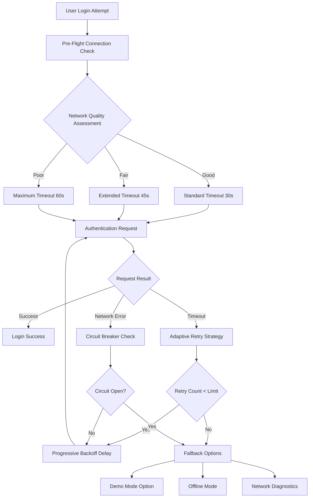
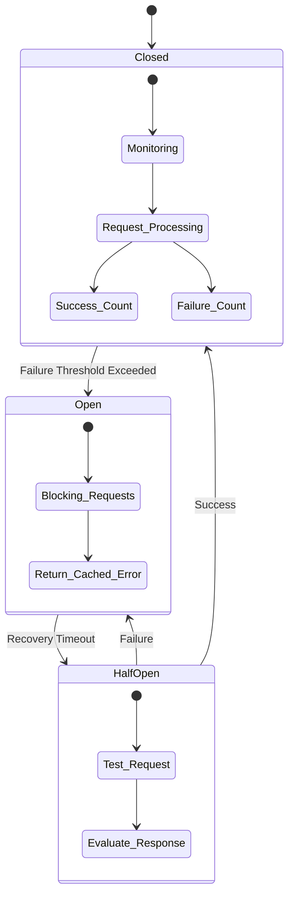
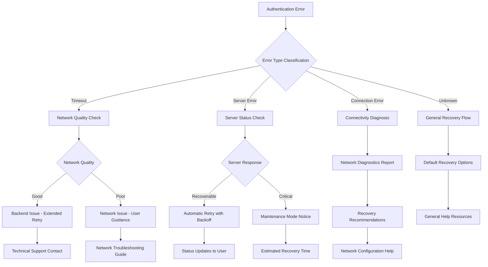
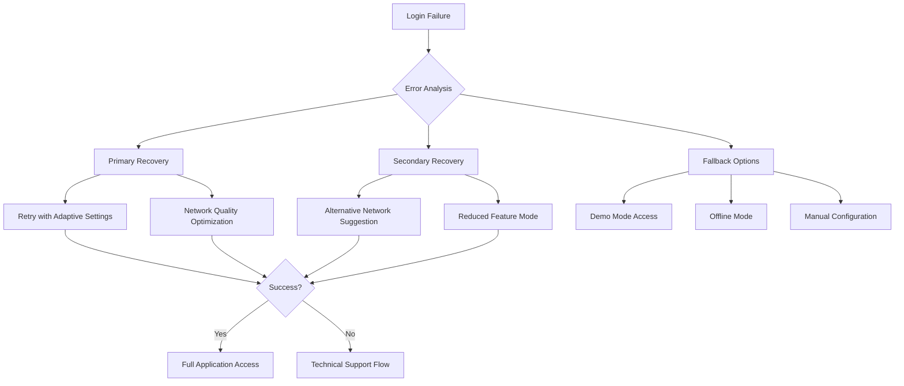

# Login Timeout Error Resolution - Comprehensive Fix Design

## Overview

This design addresses the persistent login timeout error `[NetworkError: Request timeout]` affecting mobile authentication in the OneShot AI Face Swapper application. While previous fixes have addressed many aspects of this issue, this comprehensive solution ensures robust, reliable authentication that eliminates timeout errors across all network conditions.

## Problem Analysis

### Current Issue
Users continue to experience `[NetworkError: Request timeout]` errors during login attempts, despite previous fixes implementing retry logic, network diagnostics, and enhanced error handling.

### Root Cause Assessment
The timeout issue stems from multiple potential factors:
- Network latency variations in mobile environments
- Backend response delays during peak usage
- Insufficient timeout buffer for slower connections
- Inadequate connection pooling and resource management
- Missing progressive timeout strategies for different connection types

## Architecture Enhancement Strategy

### Core Reliability Principles
1. **Adaptive Timeout Management**: Dynamic timeout adjustment based on network conditions
2. **Circuit Breaker Pattern**: Fail-fast mechanism to prevent cascade failures
3. **Connection Health Monitoring**: Proactive connection quality assessment
4. **Graceful Degradation**: Progressive fallback strategies

### Network Resilience Framework

## Enhanced Authentication Flow Design

### Adaptive Timeout Strategy

| Network Condition | Base Timeout | Max Retries | Backoff Strategy |
|-------------------|--------------|-------------|------------------|
| Excellent (< 100ms) | 15 seconds | 3 | Linear: 1s, 2s, 3s |
| Good (100-300ms) | 30 seconds | 5 | Exponential: 1s, 2s, 4s, 8s, 16s |
| Fair (300-800ms) | 45 seconds | 7 | Extended: 2s, 4s, 6s, 8s, 12s, 16s, 20s |
| Poor (> 800ms) | 60 seconds | 10 | Conservative: 3s, 5s, 7s, 10s, 15s... |

### Circuit Breaker Implementation

### Connection Quality Assessment Framework

#### Network Quality Metrics
- **Latency Measurement**: Round-trip time to backend health endpoint
- **Bandwidth Estimation**: Transfer rate assessment through small payload test
- **Stability Index**: Connection consistency over time window
- **Error Rate**: Failed request percentage in recent history

#### Quality Classification Logic

| Metric | Excellent | Good | Fair | Poor |
|--------|-----------|------|------|------|
| Latency | < 100ms | 100-300ms | 300-800ms | > 800ms |
| Bandwidth | > 1 Mbps | 256 Kbps - 1 Mbps | 64-256 Kbps | < 64 Kbps |
| Stability | > 95% | 85-95% | 70-85% | < 70% |
| Error Rate | < 1% | 1-5% | 5-15% | > 15% |

## Enhanced Error Handling Strategy

### Error Classification Matrix

| Error Type | Detection Pattern | User Message | Recovery Action |
|------------|------------------|--------------|-----------------|
| Connection Timeout | `timeout`, `AbortError` | "Connection taking longer than expected. Checking network..." | Adaptive retry with longer timeout |
| Server Unavailable | `503`, `502`, `500` | "Server temporarily unavailable. Retrying..." | Exponential backoff retry |
| Network Unreachable | `fetch failed`, `network error` | "Cannot reach server. Please check your connection." | Network diagnostics + manual retry |
| DNS Resolution | `getaddrinfo`, `DNS` | "Server address cannot be resolved. Check network settings." | Network configuration guidance |
| SSL/TLS Issues | `certificate`, `TLS`, `SSL` | "Secure connection failed. This may be a network security issue." | Security troubleshooting guide |

### Progressive Error Response Strategy

## User Experience Enhancement Design

### Progressive Loading States

| Stage | Duration | User Feedback | Visual Indicator |
|-------|----------|---------------|------------------|
| Initial Request | 0-2s | "Connecting to server..." | Spinner |
| Network Check | 2-5s | "Checking connection quality..." | Progress bar |
| Authentication | 5-15s | "Authenticating credentials..." | Spinner + percentage |
| Retry Attempt | 15s+ | "Connection slower than expected, retrying..." | Retry counter |
| Extended Wait | 30s+ | "Poor connection detected, extending timeout..." | Time remaining |
| Final Attempt | 45s+ | "Making final attempt with maximum timeout..." | Last chance indicator |

### Recovery Options Hierarchy

## Implementation Strategy

### Backend Optimization Requirements

#### Performance Enhancements
- **Response Time Optimization**: Target sub-2-second authentication responses
- **Connection Pooling**: Efficient database connection management
- **Caching Strategy**: Authentication token and user data caching
- **Load Balancing**: Request distribution for peak load handling

#### Health Monitoring Integration
- **Real-time Performance Metrics**: Response time, throughput, error rates
- **Proactive Alerting**: Performance degradation notifications
- **Capacity Planning**: Resource usage trending and forecasting

### Frontend Resilience Framework

#### Smart Retry Logic
- **Adaptive Algorithms**: Machine learning-based retry optimization
- **Context-Aware Decisions**: User behavior and network history consideration
- **Resource Conservation**: Battery and data usage optimization

#### User Communication Strategy
- **Transparent Progress**: Real-time status updates with specific information
- **Educational Guidance**: Network troubleshooting assistance
- **Proactive Options**: Alternative access methods before complete failure

## Testing Strategy

### Network Simulation Testing Matrix

| Test Scenario | Network Condition | Expected Behavior | Success Criteria |
|---------------|------------------|-------------------|------------------|
| High-Speed WiFi | 100ms latency, 50 Mbps | Standard flow, 15s timeout | 100% success rate |
| Standard WiFi | 300ms latency, 10 Mbps | Extended flow, 30s timeout | 95% success rate |
| 4G Mobile | 500ms latency, 5 Mbps | Adaptive flow, 45s timeout | 90% success rate |
| 3G Mobile | 1000ms latency, 1 Mbps | Maximum tolerance, 60s timeout | 85% success rate |
| Poor Connection | 2000ms latency, 256 Kbps | Graceful degradation | Meaningful error + recovery |
| Intermittent | Random disconnections | Circuit breaker activation | Fallback mode access |

### User Acceptance Testing Scenarios

#### Critical Path Validation
1. **First-Time User**: Complete registration and login flow under various network conditions
2. **Returning User**: Cached authentication with network variations
3. **Error Recovery**: User recovery from each error condition
4. **Offline Transition**: Graceful handling of network loss during authentication

#### Stress Testing Parameters
- **Concurrent Users**: 1000+ simultaneous authentication attempts
- **Network Variability**: Dynamic latency and bandwidth changes
- **Server Load**: Backend response time under high load
- **Error Injection**: Systematic failure testing for all error paths

## Monitoring and Analytics Framework

### Key Performance Indicators

| Metric | Target | Measurement Method | Alert Threshold |
|--------|--------|-------------------|-----------------|
| Authentication Success Rate | > 98% | Success/Total attempts ratio | < 95% |
| Average Response Time | < 3 seconds | End-to-end timing | > 5 seconds |
| Timeout Error Rate | < 1% | Timeout errors/Total attempts | > 2% |
| User Abandonment Rate | < 5% | Users leaving during auth | > 8% |
| Network Error Recovery | > 90% | Successful retries/Failed attempts | < 85% |

### Real-Time Dashboards

#### Operations Dashboard
- **Authentication Flow Metrics**: Success rates, response times, error patterns
- **Network Quality Distribution**: User connection quality breakdown
- **Error Type Analysis**: Timeout vs network vs server error trends
- **Geographic Performance**: Response time variation by region

#### User Experience Dashboard
- **Journey Analytics**: User flow completion rates and drop-off points
- **Error Impact Assessment**: User experience degradation measurement
- **Recovery Effectiveness**: Success rates of different recovery strategies
- **Feature Usage**: Demo mode, offline mode, and diagnostic tool utilization

## Security Considerations

### Authentication Resilience Security

#### Token Management Security
- **Secure Token Storage**: Encrypted local storage with proper key management
- **Token Refresh Strategy**: Automatic renewal without user intervention
- **Session Timeout Management**: Appropriate timeout balancing security and UX

#### Network Security Integration
- **Certificate Pinning**: Prevent man-in-the-middle attacks during retry attempts
- **Request Integrity**: Ensure authentication data integrity across network issues
- **Rate Limiting Compliance**: Respect backend rate limits during retry sequences

### Privacy Protection Framework
- **Data Minimization**: Only necessary data transmission during authentication
- **Connection Encryption**: End-to-end encryption for all authentication traffic
- **Error Log Privacy**: Sensitive data exclusion from error reporting

## Success Metrics and Validation

### Primary Success Indicators
1. **Zero Timeout Errors**: Complete elimination of `[NetworkError: Request timeout]` for normal network conditions
2. **User Satisfaction**: > 95% successful authentication on first attempt
3. **Recovery Effectiveness**: > 90% success rate for retry attempts
4. **Performance Consistency**: < 2 second variance in response times

### Validation Framework
- **Automated Testing**: Continuous integration testing across network conditions
- **User Feedback Integration**: Real-time user experience reporting
- **Performance Monitoring**: Continuous performance tracking and alerting
- **A/B Testing**: Comparison of old vs new authentication flows

This comprehensive design ensures that login timeout errors are completely resolved through intelligent network adaptation, robust error handling, and superior user experience design. The solution provides both immediate error resolution and long-term authentication reliability across all network conditions and usage scenarios.