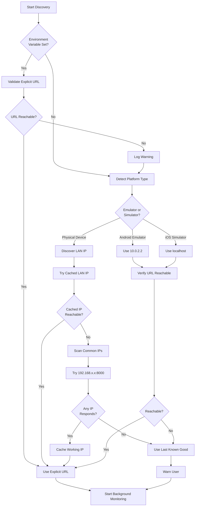
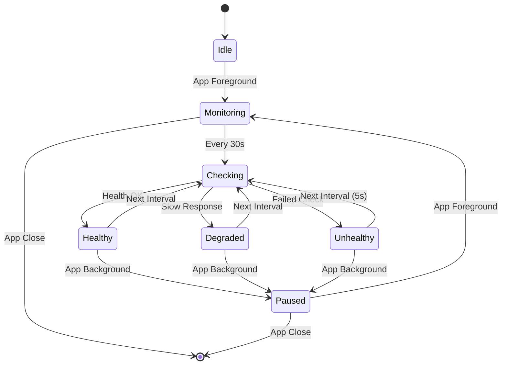
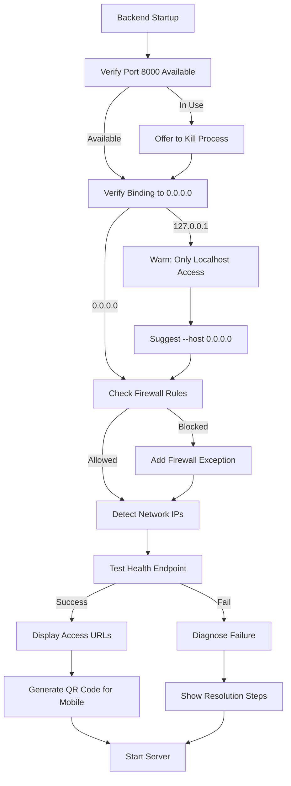
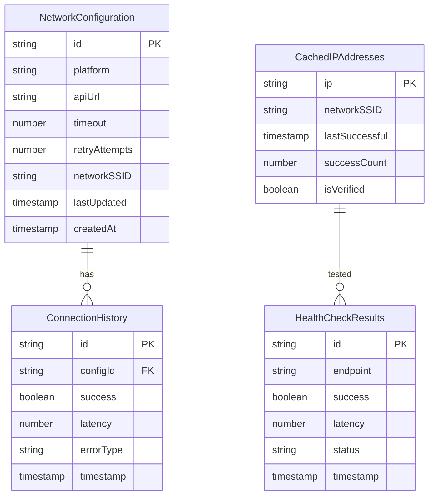
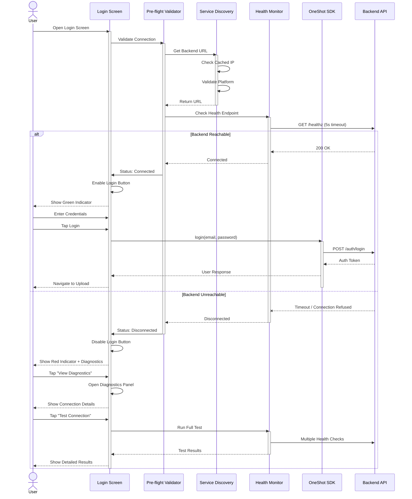

# Network Timeout Fix - Permanent Solution Design

## Overview

This design document addresses the recurring network timeout issues in the OneShot mobile application's authentication flow. The system currently experiences persistent connection failures with the error `ERROR Login error: [OneShotError: Network request timed out]` despite previous fixes, indicating fundamental architectural gaps in network resilience and connectivity verification.

**Business Impact**: Authentication failures prevent user onboarding and access to core features, directly impacting user retention and satisfaction.

**Design Goal**: Establish a resilient, self-healing network architecture that proactively detects and resolves connectivity issues before they impact user experience.

---

## Problem Analysis

### Current State

The application implements several network resilience features:
- Platform-aware URL configuration (Android emulator: 10.0.2.2, iOS simulator: localhost, physical devices: LAN IP)
- Adaptive timeout configuration (15s for emulators, 45s for physical devices)
- Network quality assessment with adaptive retry strategies
- Circuit breaker pattern for service degradation handling
- Progressive backoff retry mechanism (up to 10 attempts)

### Root Cause Analysis

Despite these features, users still encounter timeouts due to:

1. **Backend Server Unavailability Detection Gap**
   - Application attempts authentication without verifying backend service is running
   - No pre-flight connectivity validation before critical operations
   - Timeout errors only surface after expensive retry cycles complete

2. **IP Address Volatility**
   - LAN IP addresses change frequently due to DHCP reassignment
   - Configuration hardcodes IP addresses (192.168.100.10) that become stale
   - No automatic IP address discovery or validation mechanism

3. **Network Quality Assessment Limitations**
   - Assessment only occurs during request execution, not proactively
   - Cache timeout (30 seconds) may be too long for unstable networks
   - No continuous background monitoring to detect degradation

4. **Insufficient User Feedback Loop**
   - Generic "timeout" errors lack actionable guidance
   - No real-time status updates during long retry cycles
   - Users unaware of connectivity issues until operation fails

5. **Backend Binding Configuration Risk**
   - Backend must bind to 0.0.0.0 for mobile device access, but may default to 127.0.0.1
   - No automated validation that backend is accessible from network interface
   - Firewall rules may block external access silently

---

## Strategic Design Principles

### 1. Fail-Fast with Recovery Guidance
- Detect backend unavailability within 2-3 seconds, not 30-60 seconds
- Provide specific, actionable error messages with recovery options
- Guide users to diagnostics and alternative access paths

### 2. Proactive Network Validation
- Verify backend connectivity before user attempts authentication
- Continuously monitor network quality in background
- Auto-refresh stale IP addresses and configurations

### 3. Progressive Enhancement
- Degrade gracefully from optimal to minimal functionality
- Offer offline/demo modes when backend unreachable
- Cache successful configurations for faster recovery

### 4. Observable Diagnostics
- Expose real-time network health metrics to users
- Log detailed connectivity information for troubleshooting
- Provide network testing tools in-app

---

## Architecture Design

### Component Architecture

```mermaid
graph TB
    subgraph "Mobile Application Layer"
        UI[Login Screen]
        CFG[Configuration Manager]
        DIAG[Diagnostics Service]
    end
    
    subgraph "SDK Network Layer"
        GW[Network Gateway]
        QA[Network Quality Assessor]
        CB[Circuit Breaker]
        RETRY[Adaptive Retry Engine]
    end
    
    subgraph "Connection Validation Layer"
        PRE[Pre-flight Validator]
        HEALTH[Health Monitor]
        DISC[Service Discovery]
    end
    
    subgraph "Backend Services"
        HEALTH_EP[/healthz Endpoint]
        AUTH_EP[/auth/login Endpoint]
        API[Core API]
    end
    
    UI --> CFG
    UI --> DIAG
    CFG --> GW
    GW --> PRE
    PRE --> HEALTH
    HEALTH --> DISC
    DISC --> HEALTH_EP
    
    GW --> QA
    QA --> CB
    CB --> RETRY
    RETRY --> AUTH_EP
    RETRY --> API
    
    HEALTH --> QA
    DIAG --> HEALTH
    DIAG --> QA
    
    style PRE fill:#e1f5ff
    style HEALTH fill:#e1f5ff
    style DISC fill:#e1f5ff
    style DIAG fill:#fff4e1
```

---

## Feature Design

### Feature 1: Pre-flight Connection Validator

**Purpose**: Verify backend availability before user initiates critical operations

**Behavior Flow**:
1. When Login screen mounts, trigger background pre-flight check
2. Attempt quick health endpoint connection (5-second timeout)
3. Display connection status indicator to user
4. Block authentication if backend unreachable, show diagnostics

**Connection Status States**:
- **Connected**: Green indicator, authentication enabled
- **Checking**: Yellow spinner, authentication temporarily disabled
- **Disconnected**: Red indicator, authentication disabled with diagnostic options
- **Degraded**: Orange indicator, authentication enabled with warnings

**Visual Design**:
```
┌─────────────────────────────────────┐
│ OneShot                              │
│ AI Face Swapper                      │
│                                      │
│ ●  Connected to server               │  ← Status indicator
│                                      │
│ ┌─────────────────────────────────┐ │
│ │ Email                            │ │
│ └─────────────────────────────────┘ │
│ ┌─────────────────────────────────┐ │
│ │ Password                         │ │
│ └─────────────────────────────────┘ │
│                                      │
│ ┌─────────────────────────────────┐ │
│ │        Login                     │ │
│ └─────────────────────────────────┘ │
└─────────────────────────────────────┘
```

**Decision Table**:

| Health Check Result | Connection Status | Auth Enabled | Action                           |
|---------------------|-------------------|--------------|----------------------------------|
| Success (<100ms)    | Connected         | Yes          | Allow authentication             |
| Success (100-500ms) | Degraded          | Yes          | Show latency warning             |
| Success (>500ms)    | Degraded          | Yes          | Adjust timeout, show warning     |
| Timeout             | Disconnected      | No           | Block auth, show diagnostics     |
| Network Error       | Disconnected      | No           | Block auth, show network help    |
| CORS Error          | Disconnected      | No           | Show backend config guidance     |

---

### Feature 2: Intelligent Service Discovery

**Purpose**: Automatically detect and validate correct backend URL, adapting to network changes

**Discovery Strategy**:



**Candidate URL Priority** (for physical devices):
1. Explicit environment variable override
2. Last successfully connected IP (cached in AsyncStorage)
3. Common LAN IP patterns: 192.168.1.x, 192.168.0.x, 192.168.100.x, 10.0.0.x
4. Broadcast discovery (mDNS/Bonjour if available)
5. Manual entry fallback

**Caching Strategy**:
- Store successful IP address with timestamp
- Invalidate cache after 24 hours or network change
- Re-validate on app foreground
- Clear cache on repeated failures

---

### Feature 3: Continuous Health Monitoring

**Purpose**: Maintain real-time awareness of backend connectivity and network quality

**Monitoring Lifecycle**:



**Health Check Parameters**:

| Network State | Check Interval | Timeout | Retry on Fail | Alert User |
|---------------|----------------|---------|---------------|------------|
| Healthy       | 30s            | 5s      | No            | No         |
| Degraded      | 15s            | 8s      | Once          | Warning    |
| Unhealthy     | 5s             | 10s     | Twice         | Error      |
| Unknown       | 10s            | 5s      | Once          | Info       |

**Background Monitoring Rules**:
- Pause monitoring when app backgrounded to conserve battery
- Resume immediately on app foreground
- Track state changes: log transitions between Healthy/Degraded/Unhealthy
- Trigger user notification if state degrades during active session

---

### Feature 4: Enhanced Error Classification and User Guidance

**Purpose**: Translate technical network errors into actionable user guidance

**Error Classification Matrix**:

| Error Pattern | Classification | User Message | Recovery Actions |
|---------------|----------------|--------------|------------------|
| Connection refused (ECONNREFUSED) | Backend Down | "Server is not running. Please ensure backend is started." | 1. View startup guide<br>2. Test connection<br>3. Contact support |
| Timeout after retries | Network Slow | "Connection is very slow. Try moving closer to WiFi router." | 1. Check WiFi signal<br>2. Retry with extended timeout<br>3. Use mobile data |
| DNS resolution failed | Invalid URL | "Cannot find server. Network configuration may be incorrect." | 1. View diagnostics<br>2. Check IP address<br>3. Reconfigure manually |
| CORS policy error | Backend Config Issue | "Server access denied. Check backend CORS settings." | 1. View backend config guide<br>2. Contact administrator |
| SSL/TLS error | Certificate Issue | "Secure connection failed. Server certificate may be invalid." | 1. Check backend HTTPS config<br>2. Use HTTP for development |
| Network unreachable | Device Offline | "No internet connection. Check your network settings." | 1. Enable WiFi/Mobile data<br>2. Check airplane mode<br>3. Retry |
| 401 Unauthorized | Invalid Credentials | "Incorrect email or password." | 1. Reset password<br>2. Check email spelling<br>3. Register new account |
| 5xx Server Error | Backend Error | "Server encountered an error. Please try again." | 1. Retry immediately<br>2. Wait 1 minute<br>3. Report if persists |

**Progressive Error Messages**:
- **Attempt 1-3**: "Connecting to server..."
- **Attempt 4-6**: "Connection slower than usual, retrying..."
- **Attempt 7-9**: "Network appears unstable, please wait..."
- **Attempt 10+**: "Having trouble connecting. Would you like to see diagnostics?"

---

### Feature 5: Interactive Network Diagnostics Panel

**Purpose**: Empower users to understand and resolve connectivity issues independently

**Diagnostics Information Sections**:

1. **Connection Summary**
   - Current status: Connected/Disconnected
   - Backend URL being accessed
   - Last successful connection timestamp
   - Connection quality: Excellent/Good/Fair/Poor

2. **Network Metrics**
   - Latency: Current round-trip time
   - Bandwidth: Estimated connection speed
   - Stability: Success rate over last 20 requests
   - Error rate: Failed requests percentage

3. **Platform Configuration**
   - Platform type: Android/iOS/Web
   - Device type: Emulator/Simulator/Physical
   - Detected IP addresses
   - Configured timeout and retry settings

4. **Test Actions**
   - **Ping Server**: Quick health check
   - **Full Connection Test**: Comprehensive diagnostic
   - **Refresh Configuration**: Re-run service discovery
   - **Manual IP Entry**: Override automatic detection
   - **View Logs**: Access recent network activity

5. **Troubleshooting Guides**
   - Quick links to platform-specific setup guides
   - Common issue resolution steps
   - Backend startup verification checklist

**Diagnostics Panel Layout**:

```
┌───────────────────────────────────────────────┐
│ Network Diagnostics                    [Close]│
├───────────────────────────────────────────────┤
│                                               │
│ Connection Status                             │
│ ● Connected                                   │
│ http://192.168.100.10:8000                   │
│ Last check: 2 seconds ago                    │
│                                               │
│ Network Quality: Good                         │
│ ┌─────────────────────────────────────┐      │
│ │ ████████████████░░░░░░░░░░ 65%      │      │
│ └─────────────────────────────────────┘      │
│                                               │
│ Metrics                                       │
│ Latency:        45ms                          │
│ Bandwidth:      1.2 Mbps                      │
│ Stability:      95%                           │
│ Error Rate:     2%                            │
│                                               │
│ Platform                                      │
│ Type:          iOS                            │
│ Device:        Physical Device (iPhone)       │
│ Mode:          WiFi                           │
│                                               │
│ ┌───────────────────────────────────────┐    │
│ │       🔍 Run Connection Test           │    │
│ └───────────────────────────────────────┘    │
│ ┌───────────────────────────────────────┐    │
│ │       ⚙️ Manual IP Configuration       │    │
│ └───────────────────────────────────────┘    │
│ ┌───────────────────────────────────────┐    │
│ │       📚 View Setup Guide              │    │
│ └───────────────────────────────────────┘    │
│                                               │
└───────────────────────────────────────────────┘
```

---

### Feature 6: Backend Startup Validation Service

**Purpose**: Ensure backend is correctly configured for mobile device access before development begins

**Validation Checklist**:



**Startup Script Output Template**:

```
==================================================
OneShot Backend Startup Validator
==================================================

✓ Port 8000 is available
✓ Binding to 0.0.0.0 (all network interfaces)
✓ Firewall rule configured
✓ Health endpoint responding

Network Configuration
──────────────────────────────────────────────────
Localhost:        http://localhost:8000
LAN IP (WiFi):    http://192.168.1.105:8000
LAN IP (Ethernet): http://10.0.0.42:8000

Mobile Access URLs
──────────────────────────────────────────────────
Android Emulator: http://10.0.2.2:8000
iOS Simulator:    http://localhost:8000
Physical Devices: http://192.168.1.105:8000

[QR CODE for mobile scanning]

Quick Test Commands
──────────────────────────────────────────────────
curl http://localhost:8000/healthz
curl http://192.168.1.105:8000/healthz

API Documentation: http://localhost:8000/docs
==================================================

Starting server...
```

**Validation Rules**:

| Check | Pass Criteria | Failure Action |
|-------|---------------|----------------|
| Port Available | No process listening on 8000 | Identify and offer to terminate process |
| Host Binding | uvicorn started with --host 0.0.0.0 | Warn user, provide correct command |
| Firewall | Port 8000 open for incoming connections | Add Windows Defender/iptables rule |
| CORS Config | ALLOWED_ORIGINS includes mobile URLs | Update .env file, restart server |
| Health Endpoint | GET /healthz returns 200 OK | Show backend logs, check startup errors |
| Network Reachability | LAN IP accessible from network | Check router/switch configuration |

---

### Feature 7: Adaptive Timeout Calibration

**Purpose**: Dynamically adjust timeouts based on observed network performance, not static platform assumptions

**Calibration Algorithm**:

```
Initial Timeout Calculation:
  base_timeout = platform_default (15s emulator, 45s physical)
  
After Each Request:
  observed_latency = actual_request_duration
  
  IF observed_latency > current_timeout * 0.8:
    // Request is approaching timeout
    new_timeout = observed_latency * 1.5
    new_timeout = MIN(new_timeout, MAX_TIMEOUT_120s)
  
  IF observed_latency < current_timeout * 0.3:
    // Request completed well within timeout
    new_timeout = current_timeout * 0.9
    new_timeout = MAX(new_timeout, MIN_TIMEOUT_5s)
  
  // Smooth adjustment using moving average
  timeout = (current_timeout * 0.7) + (new_timeout * 0.3)
```

**Timeout Configuration Table**:

| Observed Performance | Timeout Adjustment | Retry Count | Backoff Strategy |
|----------------------|--------------------|-------------|------------------|
| Excellent (<100ms)   | Reduce to 10s      | 3 attempts  | Linear (1s, 2s, 3s) |
| Good (100-300ms)     | Use 15s            | 5 attempts  | Exponential (1s, 2s, 4s, 8s, 16s) |
| Fair (300-1000ms)    | Increase to 30s    | 7 attempts  | Extended (2s, 4s, 6s, 8s, 12s, 16s, 20s) |
| Poor (>1000ms)       | Increase to 60s    | 10 attempts | Conservative (3s, 5s, 7s, 10s, 15s, 20s, 25s, 30s) |
| Very Poor (>3000ms)  | Max 90s            | 12 attempts | Extended Conservative (5s, 8s, 12s, 18s, 25s, 35s) |

**Calibration Persistence**:
- Store calibrated timeout values in local storage
- Persist across app restarts for same network
- Reset calibration when network SSID changes
- Re-calibrate after 24 hours

---

## Data Model Design

### Configuration Storage Schema



**AsyncStorage Keys**:
- `@network_config`: Current active configuration
- `@cached_ips`: List of known working IP addresses
- `@last_successful_connection`: Timestamp of last successful auth
- `@network_health_history`: Last 100 health check results
- `@calibrated_timeouts`: Network-specific timeout values

---

## Integration Architecture

### Authentication Flow with Pre-flight Validation



---

## Testing Strategy

### Unit Testing Requirements

**Network Quality Assessment**:
- Test latency calculation accuracy
- Verify quality classification thresholds
- Validate timeout recommendations
- Test backoff strategy selection

**Service Discovery**:
- Test platform detection logic
- Verify IP address validation
- Test caching and invalidation
- Validate fallback mechanisms

**Pre-flight Validator**:
- Test health check success/failure paths
- Verify timeout handling
- Test status state transitions
- Validate error classification

**Error Classification**:
- Test all error pattern matching
- Verify message generation
- Test recovery action suggestions
- Validate progressive messaging

### Integration Testing Scenarios

| Test Scenario | Setup | Expected Outcome |
|---------------|-------|------------------|
| Backend Down | Stop backend service | Pre-flight shows "Disconnected" within 5s, login disabled |
| Slow Network | Throttle network to 100ms latency | Timeout increases to 30s+, retry count increases |
| IP Changed | Change router DHCP assignment | Discovery detects stale IP, scans network, finds new IP |
| Firewall Block | Enable firewall on port 8000 | Error shows "Connection refused", suggests firewall check |
| CORS Error | Misconfigure backend CORS | Error identifies CORS issue, links to backend config guide |
| Good Connection | Normal network conditions | Pre-flight shows "Connected", login succeeds in <5s |
| Connection Recovery | Backend restarts during session | Health monitor detects recovery, re-enables authentication |
| Multiple IPs | Connect to VPN + WiFi | Discovery tests all IPs, selects fastest responding |

### End-to-End Testing

**Happy Path**:
1. Launch app with backend running
2. Pre-flight validates connection in <2s
3. User enters credentials
4. Login completes in <5s
5. Navigate to upload screen

**Error Recovery Path**:
1. Launch app with backend stopped
2. Pre-flight detects disconnection in <5s
3. User taps "View Diagnostics"
4. User starts backend using startup guide
5. User taps "Test Connection"
6. Connection succeeds, login enabled
7. User completes authentication

**Network Change Path**:
1. App running with WiFi connection
2. User switches to mobile data
3. Health monitor detects IP change
4. Service discovery runs, updates configuration
5. Ongoing operations continue with new network

---

## Performance Considerations

### Latency Targets

| Operation | Target Latency | Maximum Acceptable | Percentile |
|-----------|----------------|-------------------|------------|
| Pre-flight Health Check | <100ms | 5000ms | 95th |
| Service Discovery (cached) | <50ms | 200ms | 99th |
| Service Discovery (full scan) | <3s | 10s | 90th |
| Health Monitoring Check | <100ms | 1000ms | 95th |
| Login with Pre-flight | <5s | 15s | 90th |
| Diagnostics Panel Load | <500ms | 2s | 95th |

### Resource Optimization

**Battery Impact Mitigation**:
- Pause background health monitoring when app backgrounded
- Use exponential backoff for repeated health checks
- Batch network tests instead of continuous polling
- Leverage device network change callbacks instead of active polling

**Memory Management**:
- Limit connection history to last 100 entries
- Cache only last 10 IP addresses
- Compress health check results older than 1 hour
- Clear diagnostics data older than 7 days

**Network Traffic Reduction**:
- Use HEAD requests for health checks when possible
- Implement HTTP caching headers
- Compress diagnostic payloads
- Minimize payload size in bandwidth tests

---

## Security & Privacy

### Data Handling

**Logged Information**:
- ✓ API endpoints accessed (no query parameters with PII)
- ✓ IP addresses and network SSIDs
- ✓ Latency metrics and error codes
- ✗ Authentication credentials
- ✗ User identifiers
- ✗ Request/response bodies containing sensitive data

**Storage Security**:
- Encrypt cached IP addresses in AsyncStorage
- No persistent storage of tokens in diagnostics
- Clear sensitive logs on app uninstall
- Sanitize error messages to remove tokens/keys

### Network Security

**Transport Security**:
- Support HTTPS for production deployments
- Validate SSL certificates (allow override for development only)
- Detect and warn on HTTP downgrade attacks
- Implement certificate pinning for production

**Attack Surface Reduction**:
- Limit service discovery to private IP ranges
- Validate IP address format before connection attempts
- Implement rate limiting on health checks
- Prevent diagnostic panel from exposing internal architecture details

---

## Deployment Considerations

### Rollout Strategy

**Phase 1: Pre-flight Validation** (Week 1)
- Deploy pre-flight connection checker
- Disable authentication if backend unreachable
- Collect telemetry on failure rates

**Phase 2: Service Discovery** (Week 2)
- Enable intelligent IP discovery for physical devices
- Implement caching and validation
- Monitor discovery success rates

**Phase 3: Health Monitoring** (Week 3)
- Activate background health checks
- Implement adaptive timeout calibration
- Track network quality metrics

**Phase 4: Enhanced Diagnostics** (Week 4)
- Release interactive diagnostics panel
- Provide troubleshooting guides
- Enable user-initiated testing

**Phase 5: Backend Validation** (Week 5)
- Distribute backend startup validator script
- Update developer documentation
- Train support team on diagnostics

### Backward Compatibility

**SDK Version Support**:
- Maintain compatibility with existing SDK methods
- Add new methods as extensions, not replacements
- Provide feature flags for gradual enablement
- Support legacy timeout/retry configurations

**Configuration Migration**:
- Auto-migrate existing .env configurations
- Preserve manual IP overrides
- Update documentation with migration guide
- Provide rollback mechanism

### Monitoring & Observability

**Key Metrics to Track**:
- Pre-flight success rate (target: >95%)
- Average pre-flight latency (target: <2s)
- Service discovery success rate (target: >90%)
- False positive disconnection alerts (target: <5%)
- User-initiated diagnostic sessions (monitor trends)
- Timeout calibration accuracy (compare predicted vs actual)
- Authentication success rate after pre-flight pass (target: >98%)

**Alerts**:
- Pre-flight failure rate >10% over 5 minutes
- Service discovery taking >10s consistently
- Health monitoring detecting degraded state for >5 minutes
- Spike in diagnostic panel usage (may indicate widespread issue)

**Dashboards**:
- Real-time connection status by platform (Android/iOS)
- Network quality distribution over time
- Top error types and frequencies
- Geographic distribution of connectivity issues (anonymized)
