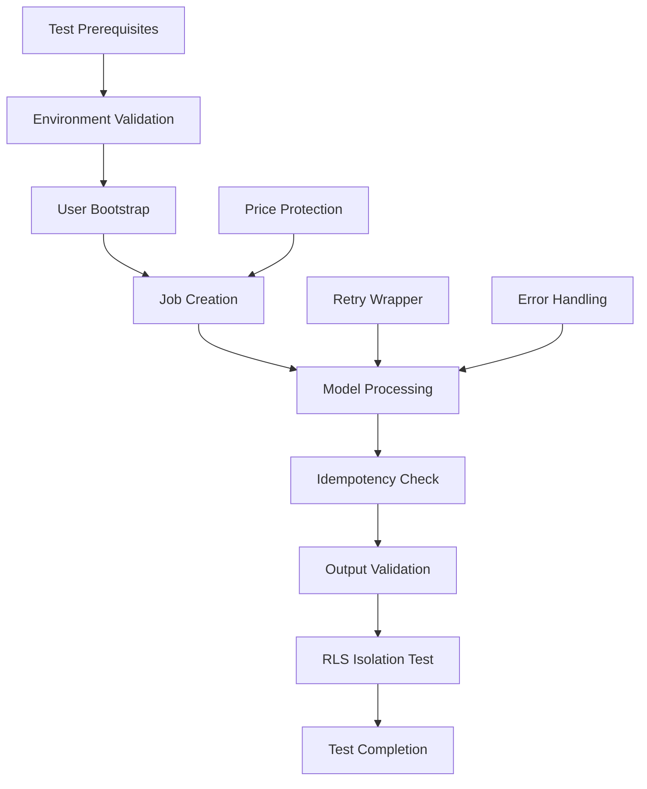
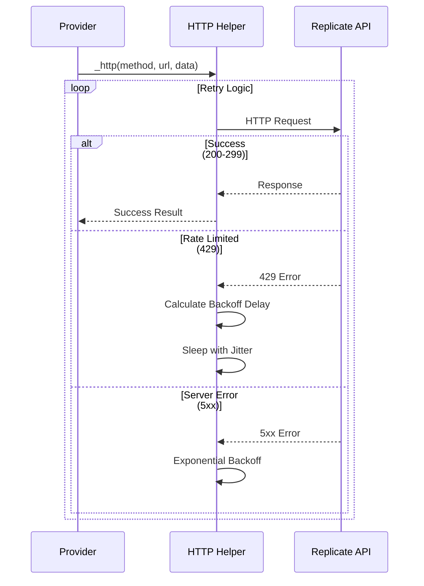
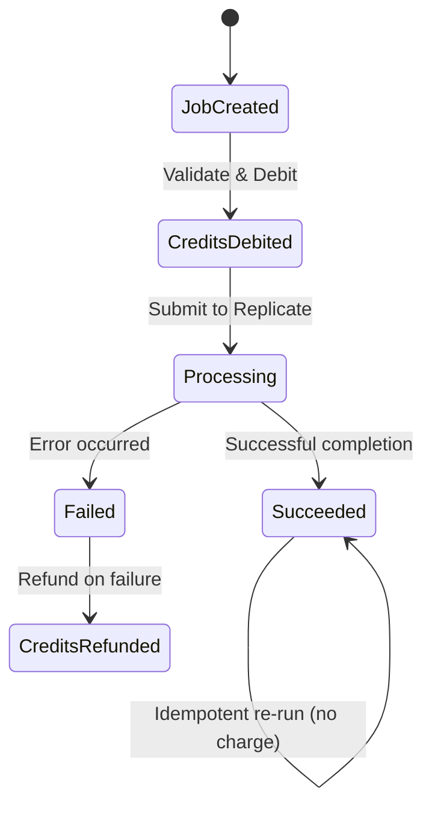
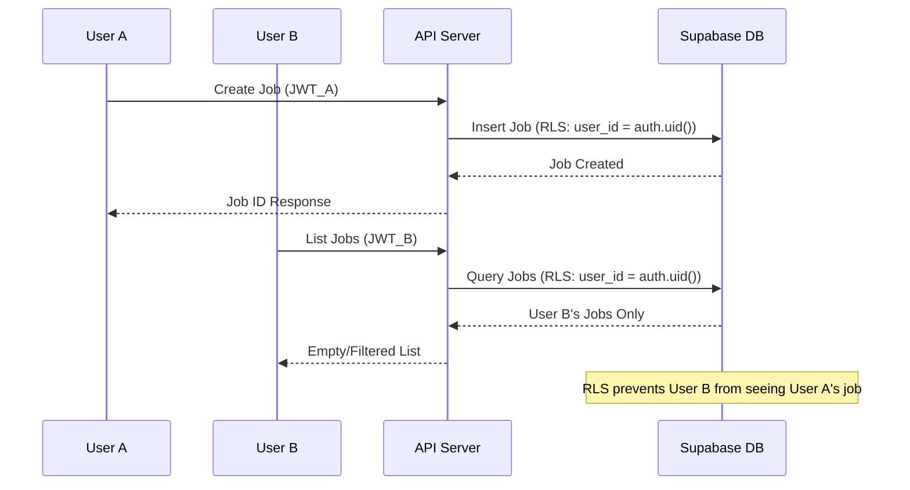

# Real Replicate Integration Testing System Design

## Overview

This design specifies the implementation of comprehensive integration tests for the Replicate AI model provider in a production-ready backend system. The testing framework validates end-to-end functionality using real Replicate API tokens while ensuring proper error handling, cost protection, and security isolation.

The system implements a black-box testing approach with shell scripts for cross-platform compatibility, validating the complete workflow from job creation through output generation while enforcing Row Level Security (RLS) and idempotency controls.

## Architecture

### Testing Framework Structure



### Component Integration Model

| Component | Responsibility | Integration Point |
|-----------|---------------|-------------------|
| Retry Wrapper | HTTP resilience for Replicate API calls | _start() and _poll() functions |
| Smoke Test Scripts | End-to-end validation workflow | Shell/PowerShell automation |
| Price Protection | Credit cost validation and idempotency | Entitlements service integration |
| RLS Validation | Security isolation verification | Multi-user scenario testing |

## Retry Strategy Enhancement

### Exponential Backoff Implementation

The Replicate provider requires robust retry logic for handling API rate limits and transient failures:

**Retry Configuration:**
- Maximum attempts: 5
- Base delay: 1 second
- Exponential multiplier: 2x
- Jitter: ±20% randomization
- Trigger conditions: HTTP 429, 5xx status codes

**HTTP Wrapper Design:**


## Smoke Testing Implementation

### Cross-Platform Test Scripts

**File Structure:**
- `backend/tests/model_smoke.sh` - Linux/macOS implementation
- `backend/tests/model_smoke.ps1` - Windows PowerShell implementation

### Test Workflow Specification

**Prerequisites Validation:**
- Environment variables: MODEL_PROVIDER=replicate, REPLICATE_API_TOKEN
- JWT tokens: TOKEN_A, TOKEN_B for two distinct users
- API endpoint configuration: API=${API:-http://localhost:8000}

**Test Sequence:**

| Step | Action | Validation |
|------|--------|------------|
| 1 | Bootstrap Profile | User A and B profile creation |
| 2 | Input Validation | Verify uploads/UID_A/in.png exists |
| 3 | Job Creation | POST /api/jobs with restore parameters |
| 4 | Job Execution | POST /api/jobs/{id}/run - first run |
| 5 | Idempotency Test | POST /api/jobs/{id}/run - second run |
| 6 | Output Verification | Validate outputs/{uidA}/... path structure |
| 7 | RLS Isolation | Verify User B cannot access User A's job |

### Error Handling Strategy

**Failure Scenarios:**
- Missing input file: Clear error message with upload instructions
- API authentication failure: Token validation feedback
- Replicate API errors: Detailed error propagation
- RLS violations: Security leak detection and reporting

## Price Protection System

### Credit Cost Configuration

**Job Type Pricing Matrix:**
| Job Type | Credit Cost | Validation |
|----------|-------------|------------|
| restore | 1 credit | Face restoration operations |
| upscale | 1 credit | Image upscaling operations |
| face_swap | 2 credits | Face swapping operations |

### Idempotency Controls

**Double-Charging Prevention:**
- Job status validation before processing
- Credit transaction atomicity
- Succeeded job re-run protection
- Credit balance delta verification (optional)

**Implementation Flow:**


## Security Validation

### Row Level Security Testing

**Multi-User Isolation Verification:**
- User A creates and processes job
- User B attempts to list jobs
- Validation: User B's job list must not contain User A's job
- Security assertion prevents data leakage

**RLS Test Implementation:**


## Integration Testing Framework

### Makefile Integration

**New Test Target:**
```
test-model: 
    TOKEN_A=$(TOKEN_A) TOKEN_B=$(TOKEN_B) bash backend/tests/model_smoke.sh || pwsh -File backend/tests/model_smoke.ps1
```

**Validation Command Sequence:**
1. `make audit` - Supabase migration audit
2. `make scan-service-role` - Service role leak detection
3. `make test-rls` - RLS enforcement validation
4. `make test-model` - Real Replicate integration test

### Success Criteria

**Acceptance Gates:**
- All four validation commands exit with status 0
- Test output contains "MODEL SMOKE OK" message
- No RLS security violations detected
- No service role leaks identified

**Go/No-Go Decision:**
- **GO**: "READY FOR PROD MODEL TRAFFIC"
- **NO-GO**: Detailed failure analysis and remediation required

## Output Path Validation

### Storage Structure Verification

**Expected Path Pattern:**
- Input: `uploads/{user_id}/in.png`
- Output: `outputs/{user_id}/{generated_filename}`

**Validation Logic:**
- Path prefix assertion: `outputs/*`
- User isolation verification
- File accessibility confirmation
- Storage bucket policy compliance

## Error Recovery and Diagnostics

### Failure Analysis Framework

**Error Categories:**
- Configuration errors: Missing environment variables
- Authentication failures: Invalid JWT tokens
- API connectivity: Network or service issues
- Processing failures: Replicate API errors
- Security violations: RLS or permission issues

**Diagnostic Output Requirements:**
- Command execution status
- Error message propagation
- Stack trace capture for debugging
- Performance metrics collection

## Testing Environment Compatibility

### Multi-Platform Support

**Shell Script Features:**
- POSIX compliance for Unix-like systems
- Error handling with `set -euo pipefail`
- JSON parsing with embedded Python
- HTTP client using curl with proper error handling

**PowerShell Features:**
- Windows compatibility
- Equivalent HTTP operations
- JSON processing capabilities
- Error handling and reporting

### Environment Configuration

**Required Environment Variables:**
- `MODEL_PROVIDER=replicate`
- `REPLICATE_API_TOKEN=<token>`
- `TOKEN_A=<user_a_jwt>`
- `TOKEN_B=<user_b_jwt>`
- `API=<base_url>` (default: http://localhost:8000)

This design ensures comprehensive validation of the Replicate integration while maintaining security, cost control, and operational reliability for production deployment.