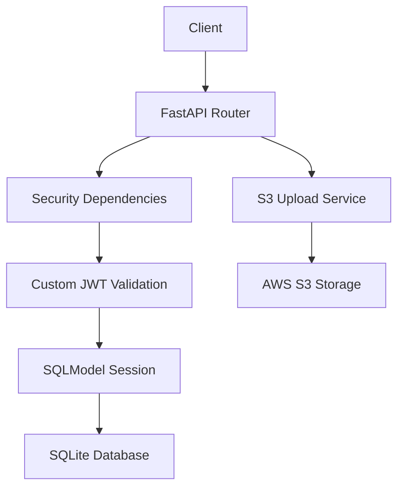
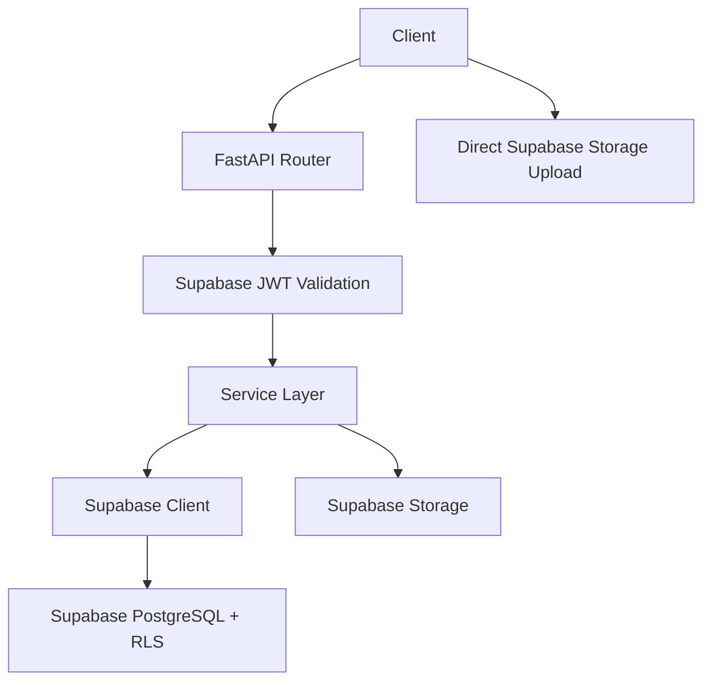
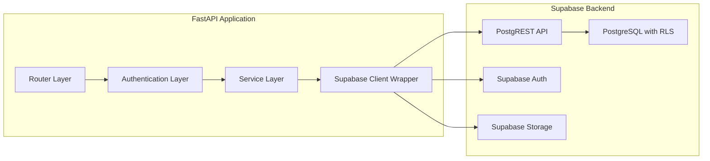
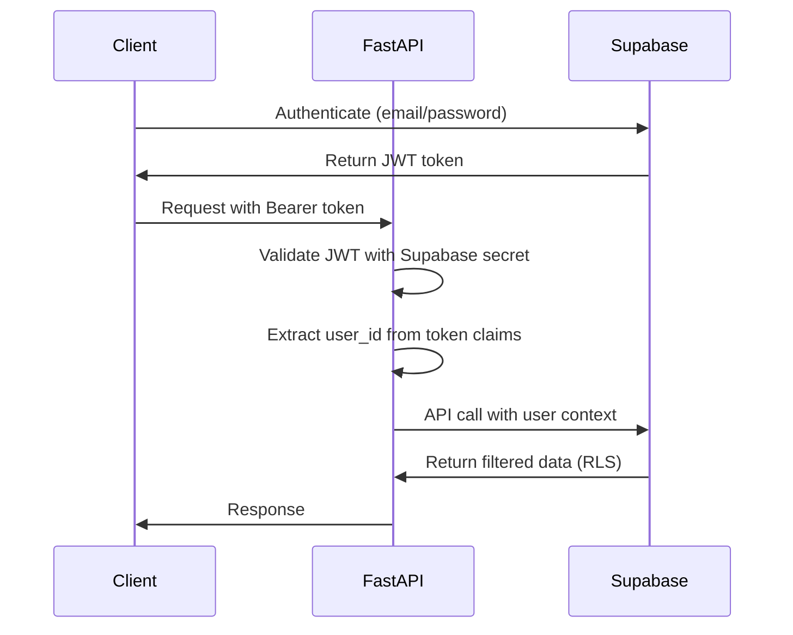
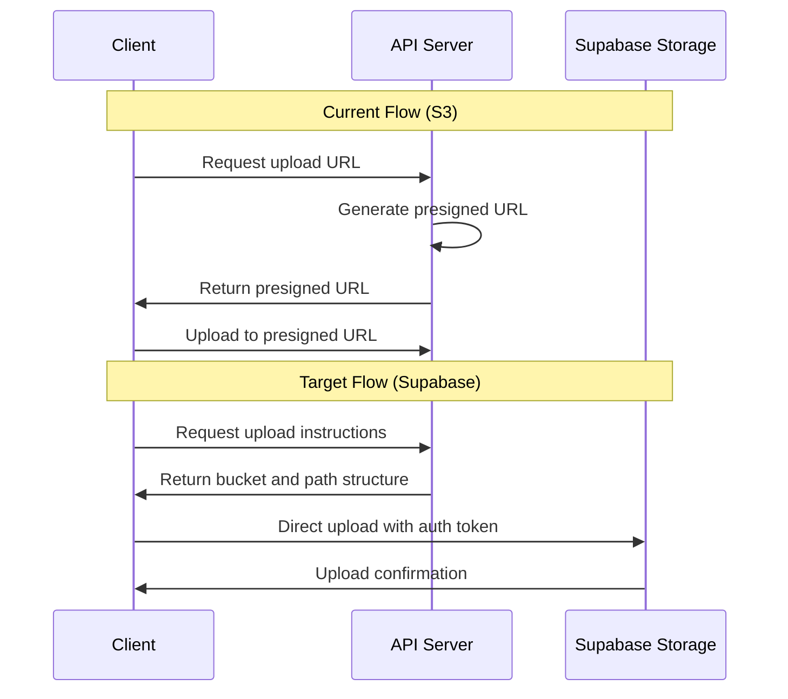
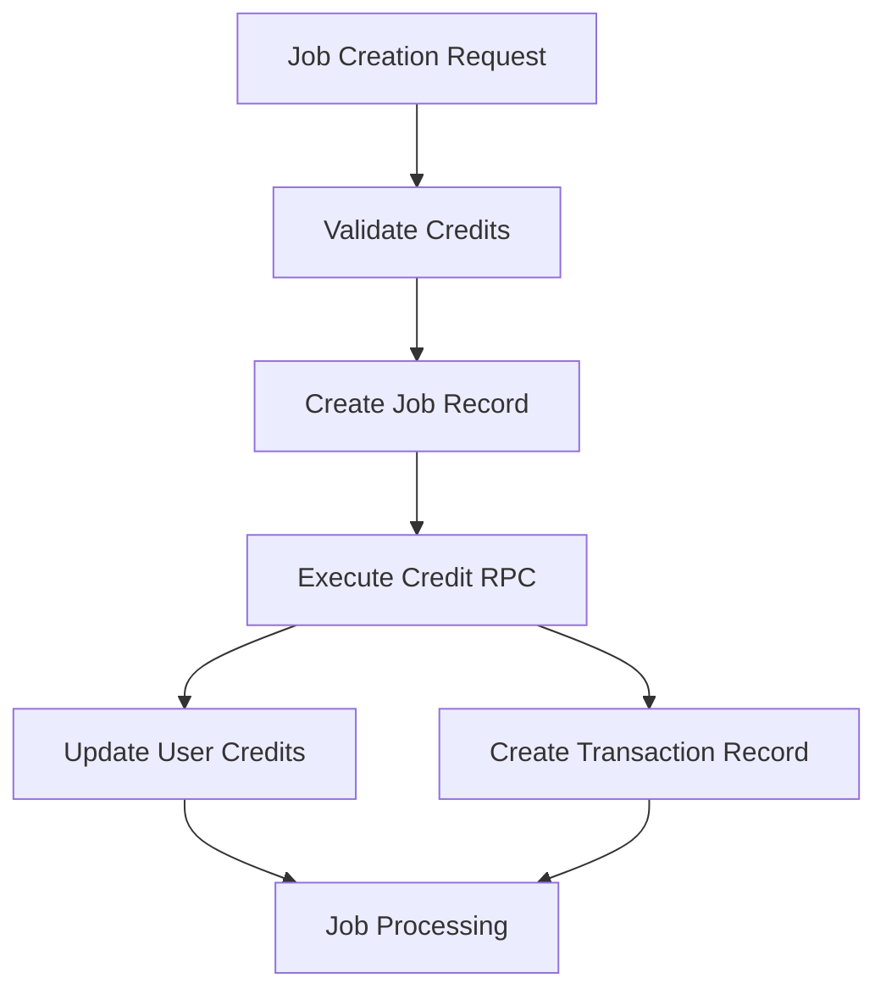

# Supabase Migration Design Document

## Overview

This document outlines the comprehensive migration strategy for transforming the existing FastAPI backend from a legacy stack (SQLModel + SQLite + custom JWT + S3) to a modern Supabase-powered architecture. The migration will replace the current authentication system, ORM patterns, and storage mechanisms with Supabase's integrated solutions while maintaining API compatibility and service reliability.

### Migration Scope
- **Authentication**: Replace custom JWT with Supabase Auth (HS256 JWT verification)
- **Database**: Migrate from SQLModel/SQLite to Supabase PostgreSQL with Row Level Security (RLS)
- **Storage**: Replace AWS S3 with Supabase Storage
- **Data Access**: Replace ORM patterns with PostgREST API calls
- **API Structure**: Maintain existing API endpoints with updated internal implementation

## Technology Stack & Dependencies

### Current Stack (Legacy)
- FastAPI with SQLModel ORM
- SQLite database with Alembic migrations
- Custom JWT authentication (jose library)
- AWS S3 for file storage
- Passlib for password hashing

### Target Stack (Supabase)
- FastAPI with Supabase Python client
- Supabase PostgreSQL with Row Level Security
- Supabase Auth JWT verification (HS256)
- Supabase Storage for file management
- PostgREST for database operations

### Dependency Updates

| Component | Current | Target | Purpose |
|-----------|---------|--------|---------|
| Database Client | sqlmodel==0.0.14 | supabase==2.* | Database operations |
| PostgreSQL Driver | N/A | psycopg2-binary (opsiyonel) | Veri migrasyon scriptleri ve tutarlılık kontrolleri |
| JWT Library | python-jose[cryptography] | PyJWT | Token verification |
| Authentication | Custom implementation | Supabase Auth | User management |
| Storage | boto3 (S3) | Supabase Storage | File operations |
| ORM | SQLModel sessions | PostgREST API calls | Data access |

## Architecture

### Current Architecture Flow



### Target Architecture Flow



### Component Architecture



## Authentication & Security Architecture

### Current Authentication Flow
1. User registration with password hashing
2. Login endpoint generates custom JWT tokens
3. Protected routes validate JWT using custom secret
4. User session management through database queries

### Target Authentication Flow
1. Client authenticates directly with Supabase Auth
2. Supabase returns JWT with standardized claims
3. API validates JWT using Supabase shared secret (HS256)
4. User context extracted from JWT claims without database queries

### Legacy User Migration Runbook
1. Çıkış almadan önce mevcut kullanıcı veritabanının tam yedeğini alın ve üretim servisini yalnızca okuma moduna alın.
2. SQLite `users` tablosundaki kullanıcı id, e-posta ve parola hashlerini export eden bir komut dosyası hazırlayın; hash algoritmasının (örn. bcrypt) Supabase ile uyumunu doğrulayın.
3. Hashler Supabase tarafından destekleniyorsa Supabase Admin API veya `supabase auth import` komutu ile kullanıcıları `auth.users` tablosuna aktarın; desteklenmiyorsa kullanıcıları e-posta ile parola sıfırlama akışına yönlendirecek bir liste oluşturun.
4. Migrasyon sonrası Supabase Panel üzerinden rastgele örnek kullanıcılarla oturum açmayı test edin; başarısız kayıtları yeniden işlemek için bir retry betiği hazırlayın.
5. Cutover sonrasında legacy JWT üretim kodu kapatılmadan önce Supabase tarafından verilen yeni JWT ile API uçlarının çalıştığını otomasyon testleriyle doğrulayın.
6. Tüm kullanıcılar için taşınmış/başarısız durum raporunu arşivleyin ve destek ekibiyle paylaşın.


### Security Model Transformation

| Aspect | Current | Target |
|--------|---------|--------|
| Token Format | Custom JWT structure | Supabase standardized JWT |
| Token Validation | Custom secret + algorithm | Supabase HS256 shared secret |
| User Sessions | Database-backed sessions | Stateless JWT validation |
| Authorization | Custom middleware | RLS policies |
| Password Management | bcrypt hashing | Supabase Auth service |

### JWT Validation Implementation

The authentication system will transform from database-dependent user lookups to stateless token validation:



## Data Models & Database Schema

### Current Data Models
- Users: Authentication and profile data
- Jobs: AI processing tasks with status tracking
- CreditTransactions: Credit usage and purchase history
- Subscriptions: Payment validation and entitlements

### Target Supabase Schema

#### Profiles Table
```
profiles (
  id: uuid PRIMARY KEY (references auth.users)
  email: text UNIQUE NOT NULL
  credits: int DEFAULT 10
  subscription_status: text DEFAULT 'inactive'
  created_at: timestamptz DEFAULT now()
  updated_at: timestamptz DEFAULT now()
)
```

#### Jobs Table
```
jobs (
  id: uuid PRIMARY KEY DEFAULT gen_random_uuid()
  user_id: uuid REFERENCES profiles(id)
  job_type: text NOT NULL
  input_image_url: text NOT NULL
  target_image_url: text
  parameters: jsonb DEFAULT '{}'
  status: text DEFAULT 'pending'
  progress: float8 DEFAULT 0
  error_message: text
  started_at: timestamptz
  completed_at: timestamptz
  created_at: timestamptz DEFAULT now()
  updated_at: timestamptz DEFAULT now()
)
```

#### Credit Transactions Table
```
credit_transactions (
  id: uuid PRIMARY KEY DEFAULT gen_random_uuid()
  user_id: uuid REFERENCES profiles(id)
  amount: int NOT NULL
  transaction_type: text NOT NULL
  job_id: uuid REFERENCES jobs(id)
  metadata: jsonb DEFAULT '{}'
  created_at: timestamptz DEFAULT now()
)
```

### Row Level Security Policies

| Table | Policy Type | Condition | Purpose |
|-------|-------------|-----------|---------|
| profiles | SELECT | auth.uid() = id | Users can only see their own profile |
| profiles | UPDATE | auth.uid() = id | Users can only update their own profile |
| jobs | SELECT | auth.uid() = user_id | Users can only see their own jobs |
| jobs | INSERT | auth.uid() = user_id | Users can only create jobs for themselves |
| jobs | UPDATE | auth.uid() = user_id | Users can only update their own jobs |
| credit_transactions | SELECT | auth.uid() = user_id | Users can only see their own transactions |
| credit_transactions | INSERT | auth.uid() = user_id | Users can only create their own transactions |

## API Endpoints Reference

### Authentication Endpoints (Removed)
The following endpoints will be removed as authentication is handled by Supabase:
- `POST /api/v1/auth/register` (replaced by Supabase Auth)
- `POST /api/v1/auth/login` (replaced by Supabase Auth)
- `POST /api/v1/auth/refresh` (replaced by Supabase Auth)

### Core API Endpoints (Maintained)

#### Profile Management
| Endpoint | Method | Purpose | Authentication |
|----------|--------|---------|----------------|
| `/api/bootstrap-profile` | POST | Initialize user profile | Required |

#### Job Management
| Endpoint | Method | Purpose | Authentication |
|----------|--------|---------|----------------|
| `/api/jobs` | POST | Create new AI processing job | Required |
| `/api/jobs` | GET | List user's jobs | Required |
| `/api/jobs/{job_id}` | GET | Get specific job details | Required |

#### Credit Management
| Endpoint | Method | Purpose | Authentication |
|----------|--------|---------|----------------|
| `/api/credits` | GET | List credit transactions | Required |

### Request/Response Schema

#### Job Creation Request
```
{
  "job_type": "face_swap" | "face_restore" | "upscale",
  "input_image_url": "string",
  "target_image_url": "string (optional)",
  "parameters": {
    "quality": "high",
    "style": "natural"
  }
}
```

#### Job Creation Response
```
{
  "id": "uuid",
  "user_id": "uuid",
  "job_type": "string",
  "status": "pending",
  "progress": 0.0,
  "created_at": "timestamp"
}
```

## Service Layer Architecture

### Current Service Pattern
Services are tightly coupled with SQLModel sessions and perform direct database operations with ORM queries.

### Target Service Pattern
Services will be stateless and interact with Supabase through the Python client, leveraging PostgREST for data operations and RLS for security.

### Service Layer Components

#### Jobs Service
- **Create Job**: Insert job record via PostgREST, debit credits via RPC
- **List Jobs**: Query user's jobs with automatic RLS filtering
- **Update Progress**: Update job status and progress for background workers

#### Credits Service
- **Add Transaction**: Record credit changes with atomic operations
- **Increment Credits**: Use database RPC for atomic credit adjustments

#### Upload Service
- **Client Upload Instructions**: Provide upload path structure for direct client uploads
- **Signed Downloads**: Generate temporary access URLs for protected content

### Service Method Transformation

| Current Method | Target Method | Change Type |
|----------------|---------------|-------------|
| `session.exec(select(...))` | `supabase.table().select().execute()` | PostgREST query |
| `session.add(model)` | `supabase.table().insert().execute()` | PostgREST insert |
| `session.commit()` | Automatic commit | Stateless operation |
| `User relationship queries` | RLS filtered results | Security layer |

#### Supabase Client Token Handling
- API isteklerinde gelen `Authorization` başlığındaki kullanıcı JWT'si, Supabase Python istemcisine `create_client(..., persist_session=False)` oluşturulduktan sonra `client.auth.set_session(access_token, refresh_token=None)` ile enjekte edilecek.
- Her servis katmanı çağrısı bu istemci üzerinden PostgREST'e gidecek; böylece RLS politikaları kullanıcı kimliğiyle devrede kalacak.
- Arka plan işçileri veya cron görevleri için `service_role` anahtarı ile ayrı bir istemci oluşturulacak ve yalnızca yönetim amaçlı RPC çağrılarında kullanılacak, kullanıcı verileri okunurken mutlaka kullanıcı token'ı forward edilecek.
- Hata ayıklama ve testler için istemci oluşturma fonksiyonu, kullanılan token veya rol bilgisini loglayarak yanlış anahtar kullanımını tespit edecek.

## Storage Strategy

### Current Storage Pattern
- Server-side S3 uploads with presigned URLs
- Custom upload management and file organization
- Application-level access control

### Target Storage Pattern
- Client-direct uploads to Supabase Storage
- Structured path organization with user ID prefixes
- Storage-level access control through policies

### Storage Organization

#### Upload Structure
```
uploads/{user_id}/{uuid}.{extension}
outputs/{user_id}/{job_id}.{extension}
```

#### Storage Policies
| Bucket | Operation | Policy SQL | Enforcement |
|--------|-----------|-----------|-------------|
| uploads | SELECT | USING (bucket_id = 'uploads' AND name LIKE auth.uid() || '/%') | Kullanıcılar yalnızca kendi dosyalarını indirebilir |
| uploads | INSERT | WITH CHECK (bucket_id = 'uploads' AND name LIKE auth.uid() || '/%') | Kullanıcılar sadece kendi klasörlerine yükleyebilir |
| outputs | SELECT | USING (bucket_id = 'outputs' AND name LIKE auth.uid() || '/%') | Kullanıcılar yalnızca kendi çıktılarını görebilir |
| outputs | INSERT | WITH CHECK (bucket_id = 'outputs' AND auth.role() = 'service_role') | Sonuç dosyaları yalnızca backend servis rolü ile yazılır |

### Upload Flow Transformation



## Business Logic Layer

### Current Business Logic
- Credit validation and deduction
- Job queue management
- Subscription processing
- File upload coordination

### Target Business Logic
- Stateless credit operations via RPC
- Job creation with automatic RLS
- Profile bootstrapping for new users
- Direct client upload coordination

### Credit System Architecture

#### Atomic Credit Operations
The credit system will use PostgreSQL stored procedures for atomic operations:



#### RPC Function Design
- **increment_credits**: Atomically adjust user credit balance
- **validate_and_debit**: Check and deduct credits in single transaction
- **Credit validation**: Prevent negative balances and race conditions

## Testing Strategy

### Current Testing Approach
- SQLModel database fixtures
- Custom JWT token generation
- Mock S3 services
- Database transaction rollbacks

### Target Testing Approach
- Supabase test environment setup
- Real JWT tokens from test project
- Supabase Storage test buckets
- RLS policy validation

### Test Categories

#### Unit Tests
- JWT validation logic
- Service layer methods
- RPC function behavior
- Error handling scenarios

#### Integration Tests
- API endpoint functionality
- Authentication flow
- File upload process
- Credit transaction integrity

#### Security Tests
- RLS policy enforcement
- JWT token validation
- Storage access control
- Cross-user data isolation

### Test Environment Configuration

| Component | Test Setup | Purpose |
|-----------|------------|---------|
| Supabase Project | Dedicated test instance | Isolated testing environment |
| Test JWT Tokens | Service role generation | Authentication testing |
| Test Data | Seed scripts | Consistent test state |
| RLS Policies | Policy verification | Security testing |

## Migration Plan

### Phase 1: Environment Setup
1. Create Supabase project and configure environment variables
2. Update dependency requirements for Supabase client
3. Create Supabase client wrapper with connection management
4. Implement JWT validation using Supabase secret

### Phase 2: Database Migration
1. Create Supabase schema with tables and relationships
2. Implement Row Level Security policies
3. Create atomic credit operation RPC functions
4. Set up storage buckets and access policies
5. Export legacy SQLite data sets (profiles, jobs, credit transactions) to staged CSV/JSON dosyaları
6. Transform exported data to Supabase şemasına uygun hale getirin (tip dönüşümleri, foreign key doğrulamaları)
7. Veri yüklemesini Supabase CLI, `psql` veya `pg_copy` ile gerçekleştirin ve başarısız kayıtlar için retry planı hazırlayın
8. Migrasyon sonrası satır sayısı ve checksum karşılaştırmaları ile doğrulama yapın

#### Data Migration Runbook
1. Migrasyon penceresini planlayın, yazma trafiğini durdurun ve SQLite dosyasının salt-okunur yedeğini alın.
2. `sqlite3` veya özel Python scripti ile kaynak tabloları dışa aktarın; UUID/string alanlarının Supabase tipleriyle eşleştiğini doğrulayın.
3. Veri dönüştürme sırasında zorunlu alanları, varsayılan değerleri ve yabancı anahtar bütünlüğünü kontrol eden otomatik testler yazın.
4. Yükleme için Supabase hizmet rolü anahtarı kullanan ayrı bir pipeline oluşturun; yükleme sırasında RLS politikalarını geçici olarak devre dışı bırakmayın, bunun yerine `service_role` ile bağlantı kurun.
5. Yükleme tamamlandığında her tablo için satır sayısı karşılaştırması, örnek kayıt kontrolü ve kritik iş akışlarını kapsayan duman testleri gerçekleştirin.
6. Başarısız kayıtların listesini kaydedin, gerekirse manuel düzeltme veya yeniden deneme akışı çalıştırın ve rollback koşullarını (SQLite kopyasını tekrar çevrimiçi alma) belgeleyin.

### Phase 3: Service Layer Refactoring
1. Replace SQLModel operations with PostgREST calls
2. Remove database session dependencies from API routes
3. Implement stateless service methods
4. Update error handling for API responses

### Phase 4: Authentication Migration
1. Remove custom JWT endpoints and middleware
2. Implement Supabase JWT validation dependency
3. Update all protected routes to use new authentication
4. Remove legacy user management code

### Phase 5: Storage Migration
1. Configure Supabase Storage buckets and policies
2. Update upload service for client-direct uploads
3. Implement signed URL generation for downloads
4. Remove S3 dependencies and configuration

### Phase 6: Testing & Validation
1. Create comprehensive test suite for new architecture
2. Validate RLS policy effectiveness
3. Test authentication flow end-to-end
4. Verify storage access control

### Migration Validation Checklist

- [ ] Environment variables configured for Supabase
- [ ] Database schema created with RLS policies
- [ ] Legacy users imported into Supabase Auth ve login testleri geçti
- [ ] SQLite verisi Supabase'e taşındı ve satır sayısı/hash kontrolleri doğrulandı
- [ ] JWT validation working with Supabase secret
- [ ] Service layer methods using PostgREST with per-request user tokens
- [ ] Storage policies enforcing user isolation
- [ ] Legacy authentication endpoints removed
- [ ] All tests passing with new architecture
- [ ] Credit operations working atomically
- [ ] File uploads working client-direct
- [ ] API compatibility maintained

## Risk Mitigation

### Technical Risks

| Risk | Impact | Mitigation Strategy |
|------|--------|-------------------|
| JWT validation failures | High | Implement fallback validation and comprehensive testing |
| RLS policy bypass | Critical | Extensive security testing and policy validation |
| Data migration errors | High | Backup strategy and incremental migration approach |
| Client upload failures | Medium | Fallback to server-side uploads if needed |
| Performance degradation | Medium | Performance testing and optimization |

### Operational Risks

| Risk | Impact | Mitigation Strategy |
|------|--------|-------------------|
| Service downtime | High | Blue-green deployment with rollback capability |
| User authentication disruption | Critical | Gradual migration with user communication |
| Data consistency issues | High | Transaction integrity verification |
| Storage access problems | Medium | Comprehensive access testing |

### Rollback Strategy
- Maintain legacy authentication code as fallback
- Keep database migration scripts reversible
- Preserve existing S3 configuration for emergency rollback
- Implement feature flags for gradual rollout
- Monitor error rates and performance metrics during migration