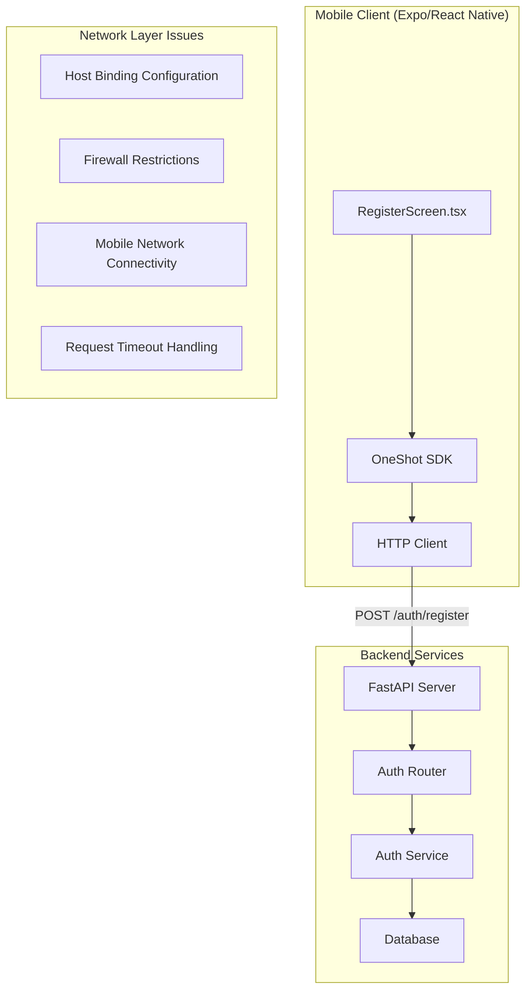
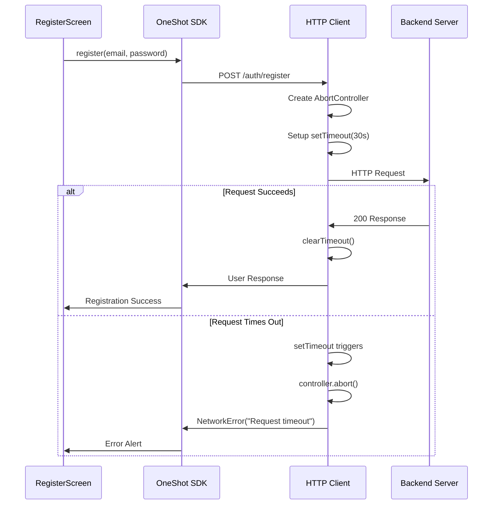
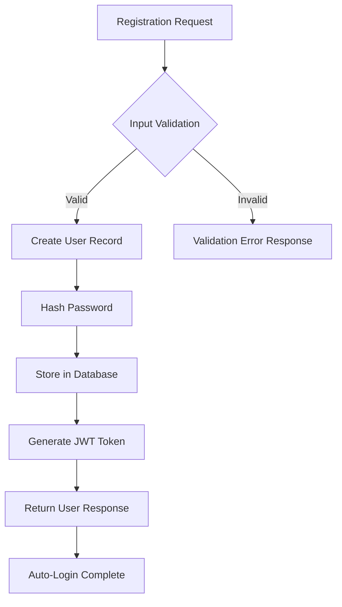

# Registration Network Timeout Error Resolution Design

## Overview

This design addresses the network timeout error occurring during user registration in the OneShot AI Face Swapper mobile application. The error manifests as "Request timeout" when users attempt to create new accounts through the Expo React Native frontend, preventing successful communication with the FastAPI backend authentication service.

## Architecture

### Current System Architecture

### Root Cause Analysis

| Issue Category | Problem Description | Impact |
|---|---|---|
| Network Configuration | Backend server bound to localhost (127.0.0.1) | Mobile devices cannot reach backend |
| Timeout Implementation | Manual timeout mechanism in HTTP client | Proper timeout handling but connectivity issues persist |
| Environment Configuration | Missing or incorrect API URL configuration | App connects to wrong or unreachable endpoints |
| Firewall Settings | Development machine firewall blocking external connections | Network requests fail from mobile devices |

## Technical Components

### 1. Backend Server Configuration

The backend server must be configured to accept connections from the local network rather than localhost only:

**Current Configuration Issues:**
- Server binds to 127.0.0.1 (localhost only)
- Not accessible from mobile devices on same network
- Requires host binding modification

**Resolution Strategy:**
- Bind server to 0.0.0.0 to accept network connections
- Maintain same port configuration (8000)
- Ensure proper CORS configuration for mobile clients

### 2. Mobile Application Network Configuration

The Expo application requires proper API endpoint configuration:

**Configuration Requirements:**
- API URL must point to development machine's LAN IP address
- Timeout values appropriately configured for mobile networks
- Environment variable management through app.json

**Network Connectivity Table:**

| Configuration Type | Current Value | Required Value | Purpose |
|---|---|---|---|
| Backend Host | 127.0.0.1:8000 | 0.0.0.0:8000 | Allow network access |
| Mobile API URL | localhost:8000 | [LAN_IP]:8000 | Enable mobile connectivity |
| Request Timeout | 30000ms | 30000ms | Adequate timeout duration |
| Retry Attempts | 3 | 3 | Appropriate retry behavior |

### 3. HTTP Client Timeout Mechanism

The HTTP client implements a manual timeout mechanism compatible with React Native:

**Timeout Flow:**

## API Integration Design

### Registration Endpoint Integration

**Request Flow:**
1. User submits registration form in RegisterScreen
2. Input validation (email format, password strength, confirmation match)
3. SDK calls HTTP client with registration data
4. HTTP client configures timeout and retry logic
5. POST request to `/auth/register` endpoint
6. Backend processes registration and auto-login
7. Response with access token and user details
8. Automatic navigation to Upload screen

**Error Handling Strategy:**

| Error Type | HTTP Status | Client Handling | User Experience |
|---|---|---|---|
| Network Timeout | N/A | Retry with backoff | "Request timeout" alert |
| Duplicate Email | 422 | Parse validation error | "Email already registered" |
| Invalid Input | 422 | Parse field errors | Specific field validation messages |
| Server Error | 5xx | Retry mechanism | "Registration failed, please retry" |
| Network Failure | N/A | No retry | "Network connection failed" |

### Authentication Service Architecture

The backend authentication service provides:

**Service Capabilities:**
- User registration with email validation
- Automatic login after registration
- JWT token generation and management
- Password hashing and verification
- User profile management

**Data Flow:**

## Network Connectivity Resolution

### Development Environment Configuration

**Host Binding Resolution:**
- Modify backend server startup to use host="0.0.0.0"
- Maintain existing port and security configurations
- Ensure CORS policies accommodate mobile clients

**Mobile Client Configuration:**
- Update API_URL to development machine's LAN IP address
- Configure app.json with proper API endpoint
- Implement environment variable management

**Network Discovery Process:**

| Step | Action | Command/Method |
|---|---|---|
| 1 | Find Development Machine IP | `ipconfig` (Windows) / `ifconfig` (Mac/Linux) |
| 2 | Update Backend Host Binding | Modify uvicorn.run() host parameter |
| 3 | Configure Mobile API URL | Update .env and app.json configuration |
| 4 | Verify Connectivity | Test with curl or browser from mobile device |

### Firewall and Security Considerations

**Windows Firewall Configuration:**
- Create inbound rule for TCP port 8000
- Apply to all network profiles (Domain, Private, Public)
- Allow connections from local network subnet

**Alternative Connectivity Solutions:**
- ngrok tunneling for external access
- Local network bridge configuration
- Development proxy server setup

## Testing Strategy

### Connectivity Verification Tests

**Backend Accessibility Testing:**
1. Local machine connectivity test: `curl http://localhost:8000/healthz`
2. Network accessibility test: `curl http://[LAN_IP]:8000/healthz`
3. Mobile device browser test: Navigate to API health endpoint
4. Registration endpoint test: Direct API call from mobile

**Mobile Application Testing:**
1. Registration form validation testing
2. Network request timeout simulation
3. Error handling and user feedback verification
4. Successful registration flow testing

### Error Scenario Testing

| Test Scenario | Expected Behavior | Verification Method |
|---|---|---|
| Network Timeout | Show timeout error alert | Monitor network logs |
| Server Unreachable | Show connection failed alert | Disconnect backend |
| Invalid Email Format | Show validation error | Test with malformed email |
| Duplicate Registration | Show email exists error | Register same email twice |
| Successful Registration | Navigate to Upload screen | Complete registration flow |

## Implementation Considerations

### Backend Service Modifications

**Server Configuration Changes:**
- Update main.py uvicorn.run() host parameter
- Maintain existing security and logging configurations
- Ensure database connectivity remains intact

**API Endpoint Verification:**
- Confirm /auth/register endpoint functionality
- Validate request/response schema compatibility
- Test authentication flow integration

### Mobile Application Updates

**Environment Configuration:**
- Update .env file with correct API URL
- Modify app.json extra configuration
- Implement proper environment variable access

**Error Handling Enhancement:**
- Improve timeout error messaging
- Add network connectivity detection
- Implement retry mechanism feedback

### Development Workflow Integration

**Setup Documentation Requirements:**
- Clear instructions for LAN IP discovery
- Step-by-step firewall configuration guide
- Alternative connectivity solution documentation
- Troubleshooting guide for common issues

**Testing Integration:**
- Automated connectivity verification scripts
- Mobile-backend connection test utilities
- Registration flow integration tests
- Error handling scenario validation