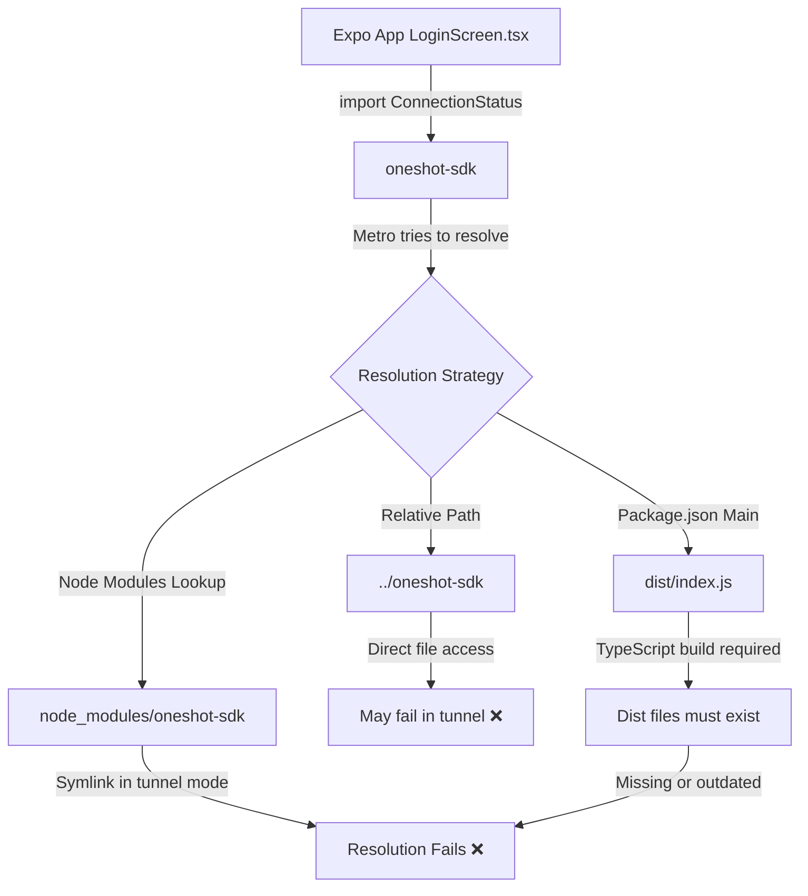
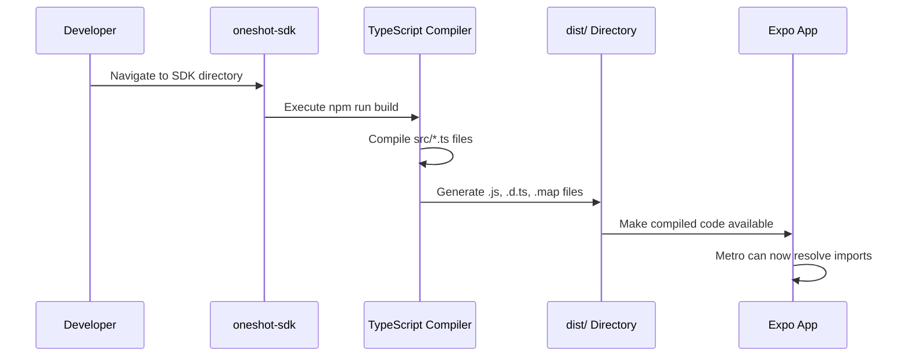
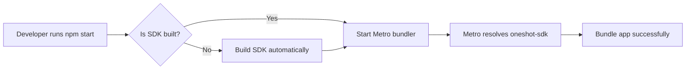
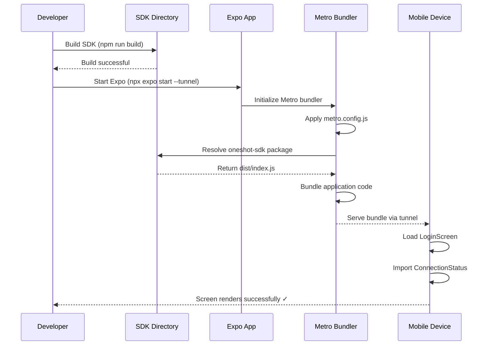

# Local SDK Module Resolution Fix for Expo Tunnel Mode

## Overview

**Problem**: When running the Expo application in tunnel mode (`npx expo start --tunnel`), the Metro bundler fails to resolve the local `oneshot-sdk` package, resulting in a "Unable to resolve 'oneshot-sdk'" error.

**Root Cause**: The SDK is linked as a local file dependency (`"oneshot-sdk": "file:../oneshot-sdk"`), but Metro's module resolution mechanism has difficulty locating local packages in certain modes, particularly when using tunnel mode or when the package structure doesn't align with Metro's expectations.

**Solution Approach**: Implement a multi-layered resolution strategy that ensures Metro can properly resolve the local SDK package regardless of the Expo development mode being used.

## Architecture

### Current Dependency Structure

| Component | Type | Location | Entry Point |
|-----------|------|----------|-------------|
| expo-app | Mobile Application | `frontend/expo-app` | `App.tsx` |
| oneshot-sdk | Local TypeScript SDK | `frontend/oneshot-sdk` | `dist/index.js` |
| Dependency Link | File Reference | package.json | `"oneshot-sdk": "file:../oneshot-sdk"` |

### Problem Analysis

### Resolution Strategy

The fix involves three complementary approaches:

1. **Metro Configuration Enhancement**: Configure Metro bundler to explicitly watch and resolve the local SDK package
2. **Build Verification**: Ensure the SDK's TypeScript compilation output exists and is current
3. **Dependency Installation Method**: Replace file reference with proper workspace linking or symbolic linking

## Solution Components

### 1. Metro Configuration Strategy

Metro bundler must be configured to:
- Watch files outside the project root (the SDK directory)
- Resolve the SDK package name to its physical location
- Include the SDK source files in the bundling process

**Configuration Parameters**:

| Parameter | Purpose | Value |
|-----------|---------|-------|
| `watchFolders` | Directories Metro should monitor | `['frontend/expo-app', 'frontend/oneshot-sdk']` |
| `nodeModulesPaths` | Additional module resolution paths | SDK parent directory |
| `extraNodeModules` | Explicit package name mapping | `{ 'oneshot-sdk': SDK_PATH }` |

### 2. SDK Build Verification

The SDK must be properly compiled before the Expo app can import it:

**Build Process Flow**:

**Required Artifacts**:
- `dist/index.js` - Main entry point (CommonJS)
- `dist/index.d.ts` - TypeScript type definitions
- `dist/*.js` - All compiled modules
- `dist/*.d.ts` - Type definitions for all modules

### 3. Dependency Linking Options

Three approaches to linking the local SDK:

#### Option A: Metro Configuration Only
- Keep `file:../oneshot-sdk` reference
- Configure Metro to handle the resolution
- Requires metro.config.js modifications

#### Option B: npm/yarn Workspace
- Convert the repository to a monorepo structure
- Use workspace features for linking
- Requires root package.json with workspaces field

#### Option C: Manual Symlink
- Create symbolic link in node_modules
- Most compatible with Metro
- Requires manual setup per installation

## Implementation Requirements

### Metro Configuration File

The Expo app requires a `metro.config.js` file with the following behavioral specifications:

**Required Capabilities**:
1. Resolve the SDK package by name ('oneshot-sdk')
2. Watch the SDK directory for file changes during development
3. Include SDK source files in transformation pipeline
4. Handle both built artifacts and source files

**Configuration Structure**:

| Section | Purpose | Key Settings |
|---------|---------|--------------|
| Resolver | Map package names to paths | `extraNodeModules`, `nodeModulesPaths` |
| Watchman | File watching configuration | `watchFolders` |
| Transformer | Code transformation rules | `assetPlugins`, `sourceExts` |

### SDK Build Requirements

Before the Expo app can successfully import the SDK:

**Pre-requisites**:
1. SDK dependencies must be installed (`npm install` in SDK directory)
2. TypeScript compilation must be executed (`npm run build` in SDK directory)
3. Build output must exist in `dist/` directory
4. Package.json `main` field must point to valid entry file

**Validation Checklist**:
- [ ] `dist/index.js` exists
- [ ] `dist/index.d.ts` exists
- [ ] All exported modules have corresponding dist files
- [ ] No TypeScript compilation errors
- [ ] Package.json main/types fields are correct

### Expo App Configuration

The Expo application needs configuration updates to support local SDK resolution:

**Configuration Files**:

| File | Purpose | Required Changes |
|------|---------|------------------|
| `metro.config.js` | Metro bundler configuration | Add watchFolders, extraNodeModules |
| `package.json` | Dependencies and scripts | Verify SDK reference, add prebuild script |
| `babel.config.js` | Babel transformation | Ensure preset-expo is configured |

**Workflow Integration**:

The development workflow should ensure the SDK is always built before starting the Expo app:

## Resolution Approaches

### Approach 1: Enhanced Metro Configuration (Recommended)

**Rationale**: This approach works with the existing file reference and is most compatible with Expo tunnel mode.

**Steps**:
1. Create `metro.config.js` in `frontend/expo-app/`
2. Configure watchFolders to include SDK directory
3. Set up extraNodeModules to map 'oneshot-sdk' to its location
4. Configure resolver to handle the local package

**Benefits**:
- No changes to package.json dependencies
- Works in all Expo modes (tunnel, LAN, localhost)
- Supports hot reloading of SDK changes
- Clear separation of concerns

**Limitations**:
- Requires SDK to be built before first use
- SDK changes need manual rebuild
- Metro configuration can be complex

### Approach 2: Monorepo Workspace Structure

**Rationale**: Using workspace features provides native package linking support.

**Steps**:
1. Create root `package.json` with workspaces field
2. Define workspaces: `["frontend/expo-app", "frontend/oneshot-sdk"]`
3. Use workspace protocol in dependencies: `"oneshot-sdk": "workspace:*"`
4. Configure Metro for workspace structure

**Benefits**:
- Standard Node.js package management
- Better tooling support
- Cleaner dependency graph
- Works with Yarn/npm workspaces

**Limitations**:
- Requires repository restructuring
- All developers must use workspace-compatible package manager
- May complicate deployment processes

### Approach 3: Build-Time Symlink Creation

**Rationale**: Create a symbolic link that Metro can reliably resolve.

**Steps**:
1. Add pre-start script to create symlink
2. Link `frontend/expo-app/node_modules/oneshot-sdk` → `frontend/oneshot-sdk`
3. Ensure SDK is built before linking
4. Update .gitignore to exclude symlink

**Benefits**:
- Simple and reliable
- Compatible with all Metro modes
- No complex configuration needed
- Easy to understand and debug

**Limitations**:
- Requires script execution before first run
- Platform-specific symlink commands (Windows vs Unix)
- Manual cleanup may be needed
- Not ideal for CI/CD environments

## Testing Strategy

### Unit Testing

**SDK Build Verification**:
- Validate all TypeScript files compile without errors
- Confirm dist/ directory contains all expected artifacts
- Verify package.json main/types fields point to valid files
- Check that all exports in index.ts are properly compiled

**Metro Configuration Validation**:
- Verify watchFolders includes SDK directory
- Confirm extraNodeModules mapping is correct
- Test that Metro can resolve 'oneshot-sdk' import
- Validate file watching triggers rebuilds correctly

### Integration Testing

**Import Resolution Test**:
- Import SDK modules in test file
- Verify all exported types are accessible
- Confirm ConnectionStatus enum is available
- Test OneShotClient instantiation

**Development Mode Testing**:

| Test Case | Scenario | Expected Result |
|-----------|----------|-----------------|
| Tunnel Mode | `npx expo start --tunnel` | SDK imports resolve successfully |
| LAN Mode | `npx expo start --lan` | SDK imports work without errors |
| Localhost Mode | `npx expo start` | SDK imports function correctly |
| Hot Reload | Modify SDK source file | Changes don't break resolution |

### End-to-End Testing

**Complete Workflow Validation**:

**Success Criteria**:
- Expo starts without resolution errors
- LoginScreen renders without import failures
- ConnectionStatus enum is available and usable
- Network diagnostics features work correctly
- App functions in tunnel mode across different devices

## Migration Path

### Immediate Fix (Quick Resolution)

**Objective**: Get the application running in tunnel mode as quickly as possible.

**Steps**:
1. Navigate to `frontend/oneshot-sdk`
2. Execute `npm install` to ensure dependencies are present
3. Execute `npm run build` to compile TypeScript to JavaScript
4. Verify `dist/` directory is populated with .js files
5. Create `metro.config.js` in `frontend/expo-app/`
6. Configure Metro with watchFolders and extraNodeModules
7. Restart Expo with tunnel mode

**Timeline**: 15-30 minutes

### Long-term Solution (Sustainable Architecture)

**Objective**: Establish a robust, maintainable SDK integration pattern.

**Phase 1 - Metro Configuration Enhancement**:
- Implement comprehensive metro.config.js
- Add SDK build verification to pre-start scripts
- Document Metro configuration decisions
- Create troubleshooting guide

**Phase 2 - Development Workflow Improvement**:
- Add watch mode for SDK during development
- Implement automatic SDK rebuild on changes
- Create development setup validation script
- Update project documentation

**Phase 3 - Consider Monorepo Migration** (Optional):
- Evaluate workspace benefits for this project
- Design monorepo structure if beneficial
- Migrate gradually with feature flags
- Update CI/CD pipelines accordingly

## Configuration Examples

### Metro Config Structure

The Metro bundler configuration should implement the following behavioral logic:

**Module Resolution Logic**:
1. When Metro encounters `import { X } from 'oneshot-sdk'`
2. Check extraNodeModules mapping for 'oneshot-sdk'
3. Resolve to the absolute path of the SDK directory
4. Load the file specified in SDK's package.json main field
5. Include SDK directory in file watching system

**Watch Folders Logic**:
- Monitor both the Expo app directory and SDK directory
- Trigger rebuilds when files in either location change
- Handle file changes in SDK dist/ directory
- Respect Metro's caching mechanisms

### Package Scripts Enhancement

The Expo app's package.json should include scripts that ensure SDK readiness:

**Pre-start Hook**:
- Verify SDK dist/ directory exists
- Check SDK build is current (compare timestamps)
- Optionally rebuild SDK if out of date
- Create symlink if using symlink approach

**Development Scripts**:

| Script Name | Purpose | Actions |
|-------------|---------|---------|
| `prestart` | Pre-flight checks | Verify SDK build, check configuration |
| `build:sdk` | Build SDK | Navigate to SDK, run build command |
| `dev` | Start with checks | Run prestart, then start Expo |
| `dev:tunnel` | Tunnel mode with prep | Ensure SDK ready, start in tunnel mode |

### Environment Validation

Before starting development, the environment should meet these conditions:

**File System Validation**:
- `frontend/oneshot-sdk/dist/index.js` exists and is readable
- `frontend/oneshot-sdk/package.json` has valid main field
- `frontend/expo-app/metro.config.js` exists with correct configuration
- SDK and Expo app have node_modules directories

**Build State Validation**:
- SDK TypeScript compilation is successful
- No type errors in SDK codebase
- Dist files are newer than source files (or equal)
- All SDK exports are properly compiled
