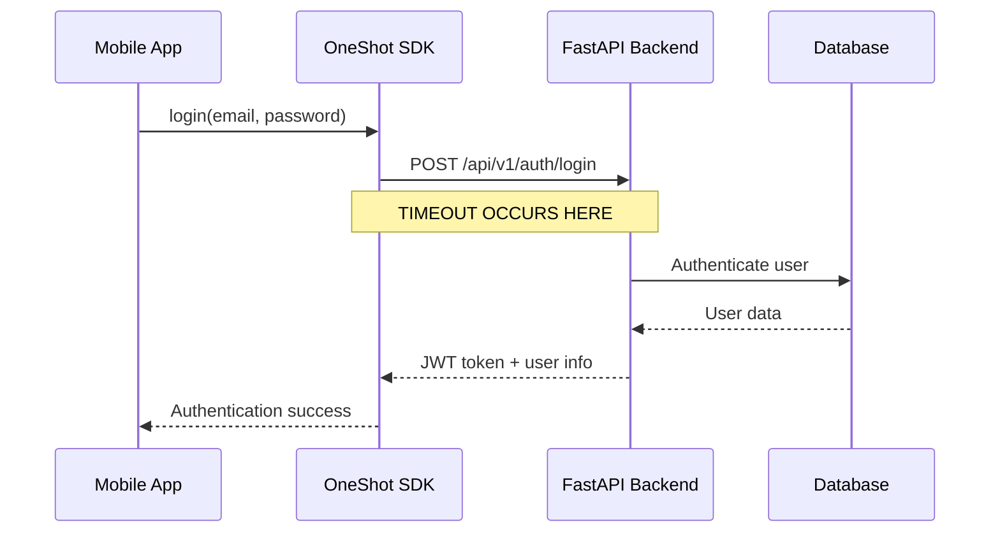
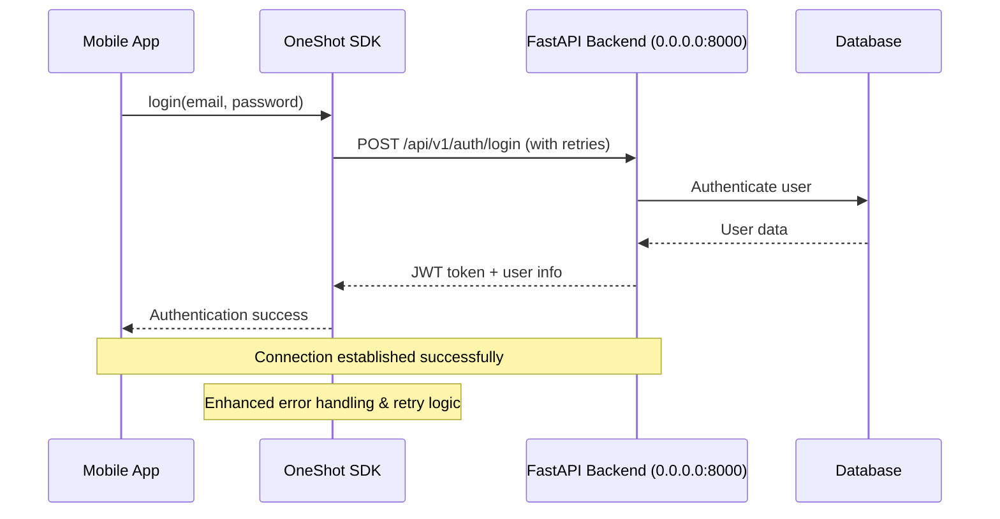
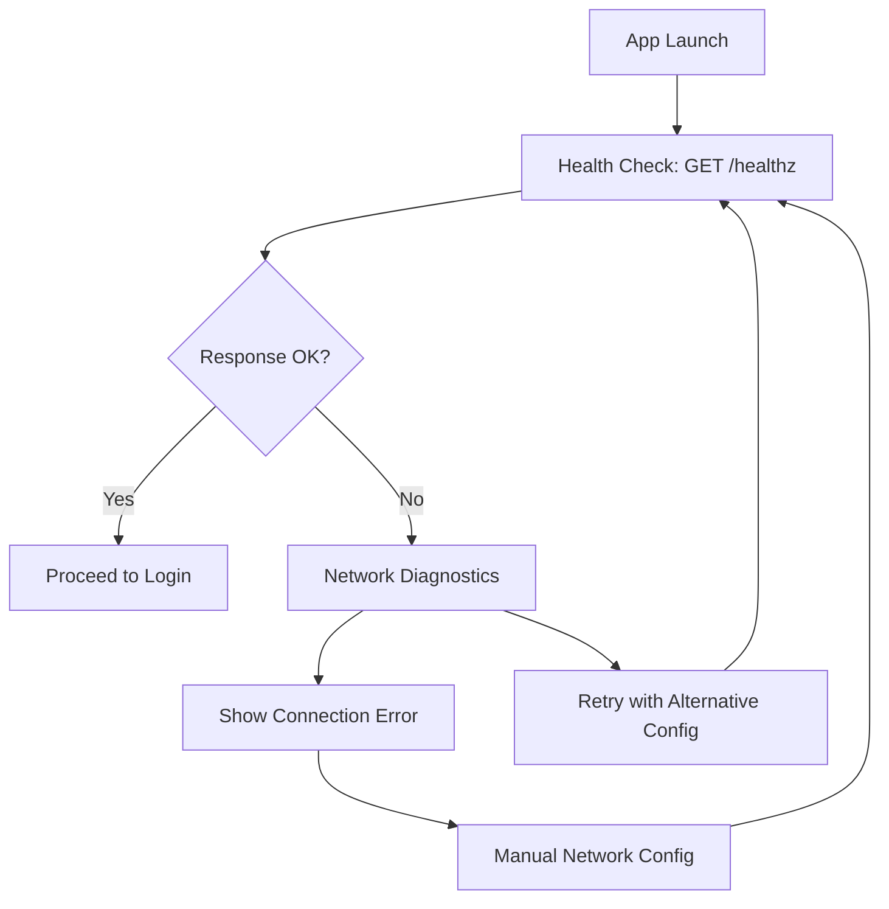
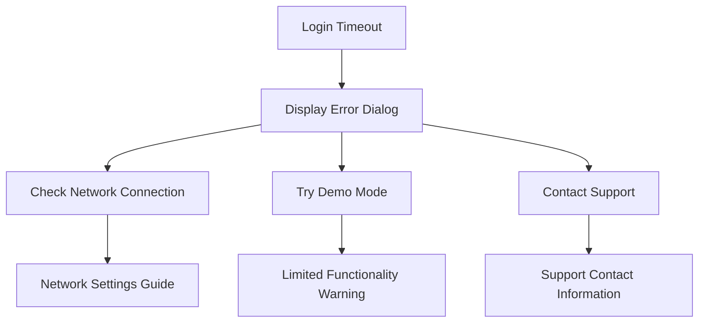

# Mobile Authentication Timeout Resolution Design

## Overview

This design addresses the "Login error: [NetworkError: Request timeout]" issue experienced when attempting to authenticate with an existing account in the OneShot expo-app. The problem stems from network connectivity issues between the mobile client and the FastAPI backend server during the authentication flow.

## Problem Analysis

### Current State
- **Client**: Expo React Native app using oneshot-sdk
- **Backend**: FastAPI server running on localhost with authentication endpoints
- **Network Configuration**: Backend configured to use IP `192.168.1.210:8000` in app.json
- **Timeout Setting**: 30-second timeout configured in SDK client
- **Error Pattern**: Consistent timeout during login attempts with valid credentials

### Root Cause Assessment
The timeout occurs due to backend server accessibility issues from mobile devices. Based on the project memory and configuration analysis:

1. **Host Binding Issue**: Backend may not be bound to `0.0.0.0` to accept external connections
2. **Network Routing**: Mobile device cannot reach the configured backend IP address
3. **Firewall Restrictions**: Local firewall blocking connections on port 8000
4. **Service Availability**: Backend authentication service may not be running properly

## Architecture

### Current Authentication Flow


### Target Resolution Flow


## Network Configuration Resolution

### Backend Server Configuration
The backend must be configured to accept connections from external devices:

| Configuration | Current State | Required State | Purpose |
|---------------|---------------|----------------|---------|
| Host Binding | localhost/127.0.0.1 | 0.0.0.0 | Allow external device connections |
| Port | 8000 | 8000 | Maintain consistent port |
| Firewall | Unknown | Port 8000 allowed | Enable network access |
| Network Interface | Loopback only | All interfaces | Mobile device connectivity |

### Mobile Client Configuration
Current configuration in `app.json`:
```json
{
  "extra": {
    "apiUrl": "http://192.168.1.210:8000",
    "apiTimeout": 30000
  }
}
```

### Alternative Network Solutions
If direct IP access continues failing, implement fallback strategies:

1. **Tunneling Service**: Use ngrok or similar for stable connectivity
2. **Local Development Server**: Ensure proper network interface binding
3. **Network Discovery**: Implement dynamic API URL detection

## Enhanced Error Handling Strategy

### SDK-Level Improvements
The oneshot-sdk already includes retry logic but needs enhancement for mobile scenarios:

| Feature | Current Implementation | Enhancement Needed |
|---------|----------------------|-------------------|
| Retry Attempts | 3 attempts | Increase to 5 for mobile |
| Retry Delay | 1000ms | Progressive backoff (1s, 2s, 4s) |
| Timeout Detection | Basic timeout handling | Enhanced timeout categorization |
| Network Error Types | Generic NetworkError | Specific timeout vs connection errors |

### Error Classification System
Implement structured error responses for different failure scenarios:

| Error Type | HTTP Status | Client Action | User Message |
|------------|-------------|---------------|-------------|
| Network Timeout | N/A | Retry with backoff | "Connection timeout. Retrying..." |
| Connection Refused | N/A | Check network config | "Cannot reach server. Check connection." |
| Invalid Credentials | 401 | Prompt re-entry | "Invalid email or password" |
| Server Error | 5xx | Retry operation | "Server temporarily unavailable" |

## Connectivity Verification Protocol

### Pre-Authentication Health Check
Implement a connectivity verification step before attempting authentication:



### Health Check Implementation
The backend already provides health check endpoints:
- `/healthz` - Basic health verification
- `/readyz` - Comprehensive readiness check
- `/health` - Legacy health endpoint

### Diagnostic Information Collection
When timeout occurs, collect diagnostic data:

| Diagnostic | Purpose | Implementation |
|------------|---------|----------------|
| Network Interface | Verify reachability | Ping test to configured IP |
| DNS Resolution | Check hostname resolution | DNS lookup verification |
| Port Availability | Confirm service listening | Port scan on 8000 |
| Response Time | Measure latency | Connection timing analysis |

## Authentication Flow Resilience

### Progressive Timeout Strategy
Implement escalating timeout values for different network conditions:

| Attempt | Timeout | Strategy |
|---------|---------|----------|
| 1 | 15 seconds | Quick attempt |
| 2 | 30 seconds | Standard timeout |
| 3 | 45 seconds | Extended timeout |
| 4+ | 60 seconds | Maximum patience |

### Fallback Authentication Methods
Provide alternative authentication paths when primary method fails:

1. **Demo Mode**: Allow temporary access for testing
2. **Offline Credentials**: Cache last successful login (with expiration)
3. **Alternative Endpoints**: Try different network configurations

## User Experience Enhancements

### Loading State Management
Enhance the current loading states in LoginScreen:

| State | Current Behavior | Enhanced Behavior |
|-------|------------------|-------------------|
| Initial Load | Simple loading spinner | Progress indicator with status |
| Retry Attempts | No feedback | "Retrying connection... (2/5)" |
| Network Issues | Generic error | Specific guidance with resolution steps |
| Success | Immediate navigation | Confirmation with user details |

### Error Recovery Guidance
Provide actionable error messages with resolution steps:



## Implementation Priority

### Phase 1: Immediate Resolution (Critical)
1. **Backend Host Configuration**: Ensure server runs with `--host 0.0.0.0`
2. **Network Connectivity Test**: Verify mobile device can reach backend IP
3. **Firewall Configuration**: Allow port 8000 through local firewall
4. **Health Check Integration**: Add connectivity verification before login

### Phase 2: Enhanced Error Handling (High)
1. **Progressive Retry Logic**: Implement backoff strategy in SDK
2. **Detailed Error Messages**: Provide specific guidance for different failures
3. **Network Diagnostics**: Add connectivity testing utilities
4. **Fallback Mechanisms**: Implement demo mode and alternative configurations

### Phase 3: User Experience (Medium)
1. **Loading State Enhancement**: Improve feedback during authentication
2. **Error Recovery Flows**: Guide users through resolution steps
3. **Network Configuration UI**: Allow manual API URL configuration
4. **Offline Capability**: Cache authentication for temporary offline use

## Testing Strategy

### Unit Testing
Focus on authentication flow components:
- SDK client timeout handling
- Error classification logic
- Retry mechanism behavior
- Network connectivity detection

### Integration Testing
Test complete authentication workflows:
- Mobile app to backend communication
- Error handling across different failure scenarios
- Recovery mechanisms and fallback options
- User experience flows for various network conditions

### Network Simulation Testing
Test behavior under different network conditions:
- Slow connections (2G/3G simulation)
- Intermittent connectivity
- Complete network loss
- High latency scenarios

## Monitoring and Diagnostics

### Client-Side Logging
Enhance logging in mobile app for debugging:
- Network request details and timing
- Error categorization and frequency
- User action sequences leading to failures
- Device and network environment information

### Backend-Side Monitoring
Leverage existing structured logging in FastAPI backend:
- Authentication attempt patterns
- Timeout and connection failure rates
- Geographic and network-based failure analysis
- Performance metrics for authentication endpoints

## Security Considerations

### Network Security
Maintain security while resolving connectivity:
- Ensure HTTPS in production environments
- Validate SSL certificates properly
- Implement proper CORS configuration for mobile access
- Maintain JWT token security during retry attempts

### Authentication Security
Preserve security during enhanced error handling:
- Limit sensitive information in error messages
- Implement rate limiting for failed attempts
- Secure storage of cached credentials
- Proper token expiration and refresh handling