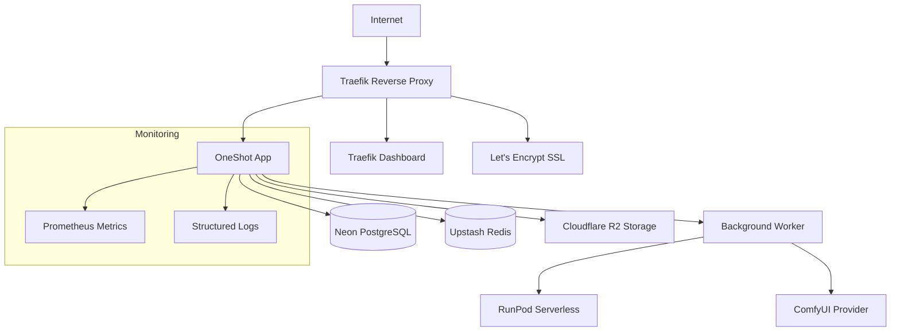

# CI/CD & Deployment Guide

This guide covers the complete CI/CD pipeline and deployment process for OneShot Face Swapper.

## 🚀 Quick Start

### One-Command Deployment

```bash
# Deploy to staging
make deploy:staging

# Deploy to production (with confirmation)
make deploy:production

# Rollback if needed
make rollback:staging
make rollback:production
```

### Smoke Testing

```bash
# Test staging deployment
make smoke-test:staging

# Test production deployment  
make smoke-test:production

# Windows PowerShell versions
make smoke-test:staging:ps
make smoke-test:production:ps
```

## 📋 Prerequisites

1. **GitHub Repository Setup**
   - Enable GitHub Actions
   - Configure GitHub Environments (see [GitHub Environments Setup](docs/github-environments-setup.md))

2. **Infrastructure Requirements**
   - Domain with DNS control (Cloudflare recommended)
   - Neon/Supabase PostgreSQL database
   - Upstash Redis instance
   - Cloudflare R2 storage bucket
   - Server with Docker and Docker Compose

3. **Required Secrets**
   - Set up secrets in GitHub Environments (staging/production)
   - Configure environment files in deploy directories

## 🏗️ Infrastructure Architecture



## 📦 CI/CD Pipeline

### Workflow Stages

1. **Build & Test** (on every push/PR)
   ```yaml
   - Lint code (flake8, black, isort)
   - Run unit tests with coverage
   - Build multi-platform Docker images
   - Cache dependencies and build layers
   ```

2. **Deploy Staging** (on develop branch)
   ```yaml
   - Deploy to staging environment
   - Run database migrations
   - Health checks (healthz, readyz, metrics)
   - Smoke tests
   - Auto-rollback on failure
   ```

3. **Deploy Production** (on main branch)
   ```yaml
   - Require manual approval
   - Deploy with zero-downtime strategy
   - Extended health checks
   - Production smoke tests
   - Manual rollback option
   ```

### Image Tagging Strategy

```bash
# Branch-based tags
ghcr.io/org/repo:develop-abc1234
ghcr.io/org/repo:main-def5678

# Semantic version tags (for releases)
ghcr.io/org/repo:v1.2.3
ghcr.io/org/repo:v1.2

# Git SHA tags
ghcr.io/org/repo:abc1234
```

## 🔧 Deployment Process

### Automated Deployment (GitHub Actions)

1. **Push to develop** → Triggers staging deployment
2. **Push to main** → Triggers production deployment (with approval)

### Manual Deployment

1. **Configure Environment**
   ```bash
   # Copy and configure environment file
   cp deploy/staging/.env.example deploy/staging/.env
   # Edit deploy/staging/.env with your values
   ```

2. **Deploy**
   ```bash
   # Deploy to staging
   make deploy:staging
   
   # Deploy with full smoke tests
   make deploy:staging:full
   ```

3. **Verify Deployment**
   ```bash
   # Check deployment status
   make deploy:status
   
   # Run smoke tests
   make smoke-test:staging
   ```

## 🛡️ Safety & Rollback

### Automatic Safety Features

- **Health Checks**: Continuous monitoring of /healthz and /readyz
- **Auto Rollback**: Automatic rollback on failed health checks
- **Zero Downtime**: Blue-green deployment strategy
- **Database Migrations**: Safe forward-only migrations

### Manual Rollback

```bash
# Rollback to previous version
make rollback:staging
make rollback:production

# Rollback to specific deployment
./scripts/rollback.sh staging deployment-id-123
```

### Rollback Process

1. Stop current services
2. Restore from backup configuration  
3. Start services from backup
4. Run health checks
5. Verify rollback success

## 📊 Monitoring & Health Checks

### Health Endpoints

```bash
# Basic health check
curl https://api.yourdomain.com/healthz

# Readiness check (includes DB/Redis)
curl https://api.yourdomain.com/readyz

# Prometheus metrics
curl https://api.yourdomain.com/metrics
```

### Smoke Test Coverage

- ✅ Core health endpoints
- ✅ API documentation access
- ✅ Authentication endpoints
- ✅ Error handling
- ✅ CORS headers
- ✅ Security headers
- ✅ SSL/TLS configuration
- ✅ Performance checks
- ✅ Database connectivity

## 🔐 Security Configuration

### HTTPS & SSL

- **Automatic SSL**: Let's Encrypt with Cloudflare DNS challenge
- **Security Headers**: HSTS, CSP, X-Frame-Options
- **TLS Configuration**: TLS 1.2+ with secure cipher suites

### Secrets Management

- **GitHub Secrets**: Encrypted secrets in GitHub Environments
- **Environment Variables**: Secure injection into containers
- **Masked Logging**: Sensitive data automatically masked in logs

## 🚨 Troubleshooting

### Common Issues

1. **Deployment Fails**
   ```bash
   # Check logs
   make logs
   
   # Check health
   curl -v https://api.yourdomain.com/healthz
   
   # Rollback if needed
   make rollback:staging
   ```

2. **SSL Certificate Issues**
   ```bash
   # Check Traefik logs
   docker-compose logs traefik
   
   # Verify DNS configuration
   dig yourdomain.com
   ```

3. **Database Migration Fails**
   ```bash
   # Check migration status
   docker-compose exec app alembic current
   
   # Run migrations manually
   docker-compose exec app alembic upgrade head
   ```

### Debugging Commands

```bash
# View deployment logs
docker-compose logs -f app

# Check container status
docker-compose ps

# Access app container
docker-compose exec app bash

# View recent deployments
make deploy:status
```

## 📈 Performance Optimization

### Docker Optimizations

- **Multi-stage builds**: Smaller production images
- **Layer caching**: GitHub Actions cache optimization
- **Security**: Non-root user, minimal attack surface

### Application Optimizations

- **Health checks**: Efficient health monitoring
- **Graceful shutdown**: Proper signal handling
- **Resource limits**: Container resource constraints

## 📚 Additional Resources

- [GitHub Environments Setup](docs/github-environments-setup.md)
- [Infrastructure Requirements](docs/infrastructure-setup.md)
- [Monitoring Guide](docs/monitoring-guide.md)
- [Security Checklist](docs/security-checklist.md)

## 🎯 Best Practices

1. **Always test in staging first**
2. **Use feature flags for risky changes**
3. **Monitor deployment metrics**
4. **Keep deployment scripts idempotent**
5. **Document all manual procedures**
6. **Regular backup verification**
7. **Security scanning in CI/CD**
8. **Load testing before production**