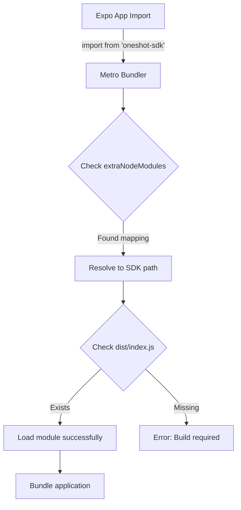
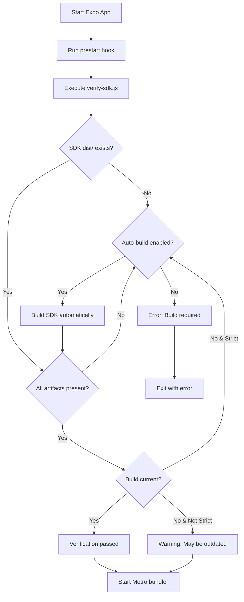

# Metro Module Resolution Fix for Local SDK

## Overview

This document explains the Metro bundler configuration implemented to resolve the local `oneshot-sdk` package in Expo tunnel mode (and all other Expo development modes).

## Problem Statement

When running the Expo application in tunnel mode (`npx expo start --tunnel`), Metro bundler was unable to resolve the locally linked `oneshot-sdk` package, resulting in the error:

```
Unable to resolve module 'oneshot-sdk' from 'src/screens/LoginScreen.tsx'
```

### Root Cause

The SDK is linked as a local file dependency in `package.json`:

```json
"oneshot-sdk": "file:../oneshot-sdk"
```

Metro's default module resolution mechanism has difficulty locating local packages in certain configurations, particularly:
- When using Expo tunnel mode
- When the package structure doesn't align with Metro's expectations
- When the local package hasn't been properly built

## Solution Architecture

The fix implements a **multi-layered resolution strategy** consisting of three components:

### 1. Metro Configuration Enhancement (`metro.config.js`)

A custom Metro configuration that:
- Explicitly maps the `oneshot-sdk` package name to its physical location
- Configures Metro to watch the SDK directory for changes
- Includes proper module resolution paths

**Key Configuration:**

```javascript
config.watchFolders = [
  projectRoot,        // Expo app directory
  sdkPath,           // SDK directory
];

config.resolver = {
  extraNodeModules: {
    'oneshot-sdk': sdkPath,  // Direct package name mapping
  },
  nodeModulesPaths: [
    path.resolve(projectRoot, 'node_modules'),
    path.resolve(sdkPath, 'node_modules'),
  ],
};
```

### 2. SDK Build Verification Script (`scripts/verify-sdk.js`)

An automated verification script that runs before starting the Expo app to ensure:
- SDK directory exists
- SDK `package.json` is valid
- Build artifacts exist in `dist/` directory
- All required files are present (`index.js`, `index.d.ts`)
- Optionally rebuilds the SDK if needed

**Features:**
- Automatic SDK building if artifacts are missing
- Timestamp comparison to detect outdated builds
- Comprehensive error reporting
- Environment variable configuration

**Environment Variables:**
- `SDK_AUTO_BUILD` - Enable/disable automatic SDK building (default: true)
- `SDK_STRICT_MODE` - Enable strict timestamp checking (default: false)

### 3. Development Setup Script (`scripts/setup-dev.js`)

A one-time setup script that prepares the development environment by:
- Installing SDK dependencies
- Building the SDK
- Installing Expo app dependencies
- Verifying all configurations

## Directory Structure

```
frontend/
├── expo-app/
│   ├── metro.config.js              # Metro bundler configuration
│   ├── package.json                 # Updated with new scripts
│   ├── scripts/
│   │   ├── verify-sdk.js           # SDK verification script
│   │   ├── setup-dev.js            # Development setup script
│   │   └── check-api.js            # Existing API check
│   └── src/
│       └── screens/
│           └── LoginScreen.tsx      # Imports from oneshot-sdk
└── oneshot-sdk/
    ├── package.json                 # SDK package configuration
    ├── tsconfig.json               # TypeScript configuration
    ├── src/                        # TypeScript source files
    └── dist/                       # Compiled JavaScript output
        ├── index.js                # Main entry point
        ├── index.d.ts             # Type definitions
        └── ...                     # Other compiled files
```

## Usage

### Initial Setup

Run the setup script once to prepare your development environment:

```bash
cd frontend/expo-app
npm run setup:dev
```

This will:
1. Install SDK dependencies
2. Build the SDK
3. Install Expo app dependencies
4. Verify all configurations

### Development Workflow

The SDK verification runs automatically when starting the Expo app:

```bash
# Standard development mode with verification
npm run dev

# Tunnel mode with verification
npm run dev:tunnel

# LAN mode with verification
npm run dev:lan

# Use the standard start (verification runs via prestart hook)
npm start
```

### Manual SDK Operations

If you need to manually work with the SDK:

```bash
# Verify SDK build without starting Expo
npm run verify:sdk

# Build SDK manually
npm run build:sdk
```

### Available Scripts

| Script | Description |
|--------|-------------|
| `npm start` | Start Expo with automatic SDK verification |
| `npm run dev` | Start Expo in local mode with verification |
| `npm run dev:tunnel` | Start Expo in tunnel mode with verification |
| `npm run dev:lan` | Start Expo in LAN mode with verification |
| `npm run setup:dev` | Initial development environment setup |
| `npm run verify:sdk` | Verify SDK build status |
| `npm run build:sdk` | Build the SDK manually |
| `npm run reset:metro` | Clear Metro cache and restart |

## How It Works

### Module Resolution Flow



### Build Verification Flow



## Configuration Details

### Metro Config Breakdown

**watchFolders**: Directories Metro should monitor for changes
```javascript
config.watchFolders = [
  projectRoot,  // frontend/expo-app
  sdkPath,      // frontend/oneshot-sdk
];
```

**extraNodeModules**: Direct package name to path mapping
```javascript
config.resolver.extraNodeModules = {
  'oneshot-sdk': sdkPath,  // Maps import to actual location
};
```

**nodeModulesPaths**: Additional module resolution paths
```javascript
config.resolver.nodeModulesPaths = [
  path.resolve(projectRoot, 'node_modules'),
  path.resolve(sdkPath, 'node_modules'),
];
```

### Package.json Configuration

The SDK must have proper entry point configuration:

```json
{
  "name": "oneshot-sdk",
  "main": "dist/index.js",      // Main entry point
  "types": "dist/index.d.ts",   // TypeScript definitions
  "scripts": {
    "build": "tsc"               // Build command
  }
}
```

## Troubleshooting

### Issue: "Unable to resolve 'oneshot-sdk'"

**Cause**: SDK is not built or Metro cache is stale

**Solution**:
```bash
# Clear Metro cache
npm run reset:metro

# Or manually clear cache and restart
npx expo start -c
```

### Issue: "SDK dist/ directory not found"

**Cause**: SDK has not been built

**Solution**:
```bash
# Build SDK manually
npm run build:sdk

# Or run setup
npm run setup:dev
```

### Issue: "Type errors when importing from SDK"

**Cause**: TypeScript definitions are missing or outdated

**Solution**:
```bash
# Rebuild SDK
cd ../oneshot-sdk
npm run build

# Then restart Expo
cd ../expo-app
npm run dev
```

### Issue: Module resolution works in local mode but fails in tunnel mode

**Cause**: Metro configuration not properly loaded

**Solution**:
1. Verify `metro.config.js` exists in `frontend/expo-app/`
2. Check that the file exports the config properly
3. Restart Expo with cleared cache: `npm run reset:metro`

### Issue: Hot reload not working for SDK changes

**Expected Behavior**: SDK changes require manual rebuild

**Workflow**:
```bash
# Terminal 1: Make changes to SDK
cd frontend/oneshot-sdk
# Edit files...
npm run build

# Terminal 2: Metro will detect changes and reload
# (Already running: npm run dev:tunnel)
```

## Testing

### Verify Metro Configuration

```bash
# Start Expo and check Metro output
npm run dev:tunnel

# Look for logs like:
# [Metro] Resolving oneshot-sdk: ...
```

### Test All Development Modes

```bash
# Test tunnel mode
npm run dev:tunnel

# Test LAN mode
npm run dev:lan

# Test local mode
npm run dev
```

### Verify SDK Import

In your React Native component:

```typescript
import { OneShotClient, ConnectionStatus } from 'oneshot-sdk';

// Should work without errors
const client = new OneShotClient({
  baseURL: 'http://localhost:3000',
  apiKey: 'test-key',
});
```

## Best Practices

### Development Workflow

1. **Initial Setup**: Run `npm run setup:dev` once
2. **Daily Development**: Use `npm run dev:tunnel` (automatic verification)
3. **SDK Changes**: Rebuild SDK after changes: `npm run build:sdk`
4. **Clean State**: Use `npm run reset:metro` if issues occur

### SDK Development

When actively developing the SDK alongside the Expo app:

1. Make changes to SDK source files in `frontend/oneshot-sdk/src/`
2. Build SDK: `cd frontend/oneshot-sdk && npm run build`
3. Metro will detect changes and reload the app automatically
4. For major changes, restart Metro: `npm run reset:metro`

### Continuous Integration

In CI/CD pipelines, ensure SDK is built before starting tests:

```bash
# .github/workflows/test.yml
- name: Build SDK
  run: |
    cd frontend/oneshot-sdk
    npm install
    npm run build

- name: Run Expo tests
  run: |
    cd frontend/expo-app
    npm install
    npm test
```

## Environment Variables

Configure SDK verification behavior:

```bash
# Disable automatic SDK building
export SDK_AUTO_BUILD=false
npm run dev:tunnel

# Enable strict timestamp checking
export SDK_STRICT_MODE=true
npm run verify:sdk
```

## Migration Notes

### Upgrading Existing Projects

If you have an existing Expo app that needs this fix:

1. Copy `metro.config.js` to your Expo app root
2. Copy `scripts/verify-sdk.js` to your scripts directory
3. Copy `scripts/setup-dev.js` to your scripts directory
4. Update `package.json` scripts section
5. Run `npm run setup:dev`

### Alternative Approaches

This implementation uses **Approach 1: Enhanced Metro Configuration** from the design document. Other options include:

- **Monorepo Workspace**: Use npm/yarn workspaces (requires repo restructuring)
- **Manual Symlink**: Create symlink in node_modules (platform-specific)

The current approach was chosen for:
- Minimal changes to existing structure
- Cross-platform compatibility
- Clear separation of concerns
- Good developer experience

## Performance Considerations

### Build Time

- SDK builds typically take 5-10 seconds
- Builds are cached and only run when needed
- Use `SDK_AUTO_BUILD=false` to skip automatic builds if SDK is already built

### Metro Bundle Time

- Metro configuration adds minimal overhead
- watchFolders may slightly increase initial bundle time
- Hot reload performance is not affected

## Security Considerations

- SDK verification scripts run locally only
- No network requests are made during verification
- Build artifacts are not committed to version control
- SDK is built from local source, not downloaded

## Future Enhancements

Potential improvements:

1. **Watch Mode**: Automatically rebuild SDK on source changes
2. **Parallel Building**: Build SDK in parallel with Expo app startup
3. **Caching**: Smart caching based on source file hashes
4. **Workspace Migration**: Consider migrating to npm workspaces
5. **Docker Support**: Add Docker configuration for consistent environments

## Support

For issues or questions:

1. Check the troubleshooting section above
2. Verify SDK is built: `npm run verify:sdk`
3. Clear Metro cache: `npm run reset:metro`
4. Run setup again: `npm run setup:dev`

## References

- [Metro Bundler Configuration](https://facebook.github.io/metro/docs/configuration)
- [Expo Custom Metro Config](https://docs.expo.dev/guides/customizing-metro/)
- [TypeScript Project References](https://www.typescriptlang.org/docs/handbook/project-references.html)
- [npm Local Packages](https://docs.npmjs.com/cli/v8/configuring-npm/package-json#local-paths)

## Changelog

### Version 1.0.0 (2025-10-16)

- Initial implementation of Metro module resolution fix
- Added SDK build verification script
- Added development setup script
- Updated package.json with new scripts
- Created comprehensive documentation
