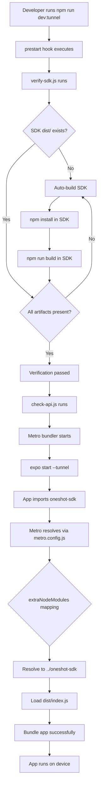
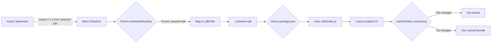
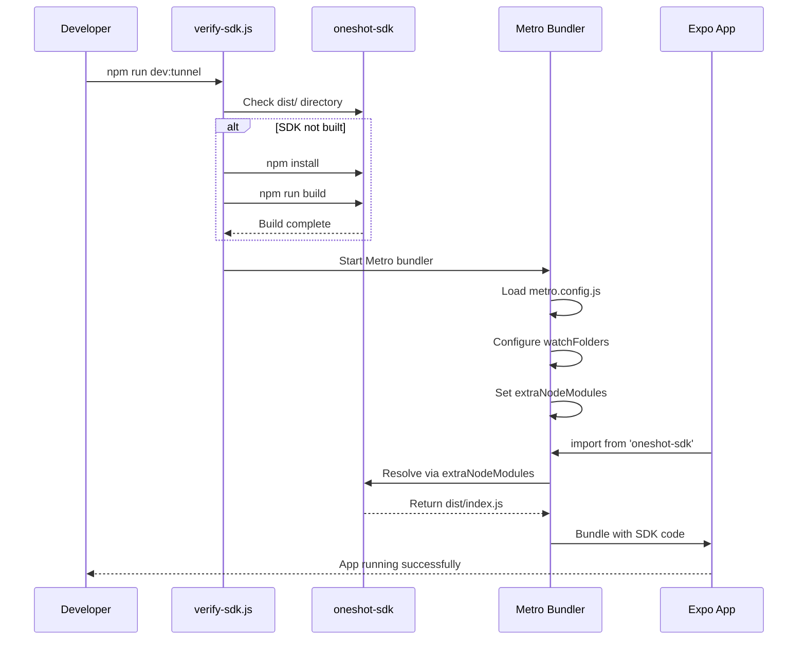
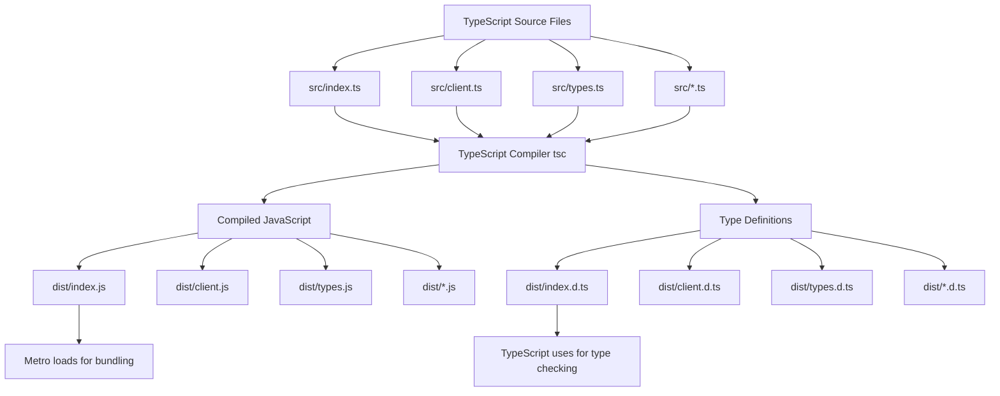
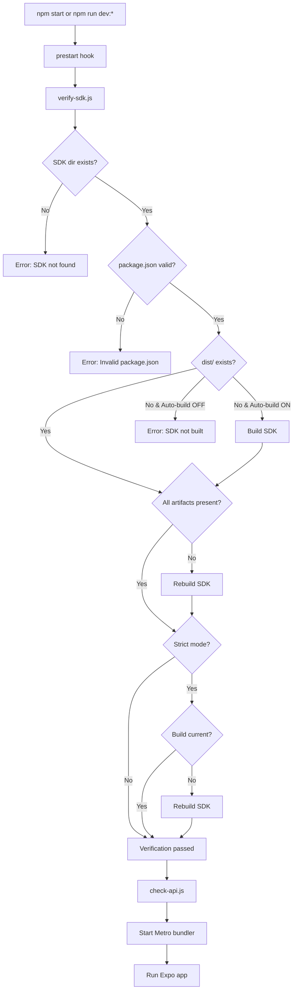
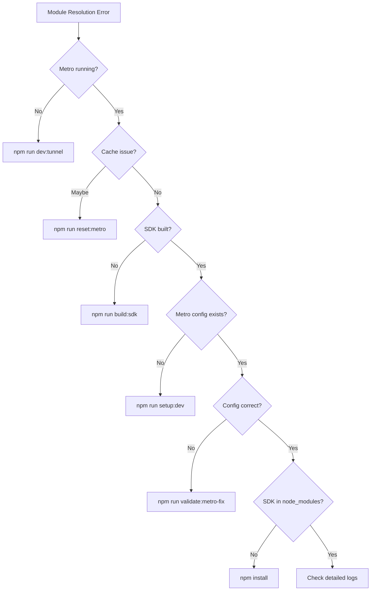
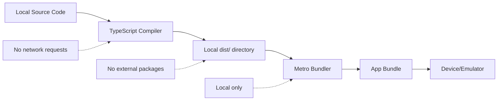

# Metro SDK Resolution - Solution Architecture

## Complete Solution Flow

### Module Resolution Flow



### Metro Configuration Architecture



### File Structure

```
qoder-deneme/
├── frontend/
│   ├── expo-app/
│   │   ├── metro.config.js ────────────┐
│   │   │   • watchFolders              │
│   │   │   • extraNodeModules          │
│   │   │   • nodeModulesPaths          │
│   │   │                               │
│   │   ├── package.json                │
│   │   │   • "oneshot-sdk": "file:../" │
│   │   │   • Scripts for SDK mgmt      │
│   │   │                               │
│   │   ├── scripts/                    │
│   │   │   ├── verify-sdk.js ──────────┼─── Verifies SDK build
│   │   │   ├── setup-dev.js ───────────┼─── Initial setup
│   │   │   └── validate-metro-fix.js ──┼─── Validates implementation
│   │   │                               │
│   │   └── src/                        │
│   │       └── screens/                │
│   │           └── LoginScreen.tsx ────┼─── Imports from oneshot-sdk
│   │                                   │
│   └── oneshot-sdk/ ◄──────────────────┘
│       ├── package.json
│       │   • main: dist/index.js
│       │   • types: dist/index.d.ts
│       │
│       ├── src/                   (TypeScript source)
│       │   ├── index.ts
│       │   ├── client.ts
│       │   └── types.ts
│       │
│       └── dist/                  (Compiled JavaScript)
│           ├── index.js           ◄─── Metro loads this
│           ├── index.d.ts         ◄─── TypeScript uses this
│           └── ...
```

### Development Workflow



### SDK Build Process



### Script Execution Flow



## Key Components

### 1. Metro Config (metro.config.js)

**Purpose**: Configure Metro to resolve local SDK package

**Key Settings**:
- `watchFolders`: Monitor both app and SDK directories
- `extraNodeModules`: Map package name to physical location
- `nodeModulesPaths`: Additional resolution paths

### 2. Verification Script (verify-sdk.js)

**Purpose**: Ensure SDK is built before running app

**Checks**:
- ✓ SDK directory exists
- ✓ package.json is valid
- ✓ Build artifacts exist
- ✓ All required files present
- ✓ Build is current (optional)

**Actions**:
- Auto-build if needed
- Comprehensive error reporting
- Environment variable configuration

### 3. Setup Script (setup-dev.js)

**Purpose**: One-time development environment setup

**Steps**:
1. Verify SDK exists
2. Install SDK dependencies
3. Build SDK
4. Verify build
5. Install Expo dependencies
6. Verify Metro config

### 4. Validation Script (validate-metro-fix.js)

**Purpose**: Validate implementation completeness

**Checks**:
- Metro config exists and is correct
- All scripts present and executable
- Package.json updated correctly
- SDK structure is valid
- Documentation files exist

## Resolution Comparison

### Before Fix

```
Developer: npm run dev:tunnel
Metro: Starting bundler...
Metro: Resolving 'oneshot-sdk'...
Metro: ✗ Unable to resolve module 'oneshot-sdk'
Metro: ✗ Module not found in node_modules
App: ✗ Failed to load
```

### After Fix

```
Developer: npm run dev:tunnel
verify-sdk: Checking SDK build...
verify-sdk: ✓ SDK directory found
verify-sdk: ✓ Build artifacts present
verify-sdk: ✓ Verification passed
Metro: Starting bundler...
Metro: Loading metro.config.js
Metro: Configuring watchFolders
Metro: Setting extraNodeModules
Metro: Resolving 'oneshot-sdk'...
Metro: ✓ Resolved to ../oneshot-sdk
Metro: ✓ Loaded dist/index.js
App: ✓ Running successfully
```

## Environment Variables

```bash
# Disable automatic SDK building
export SDK_AUTO_BUILD=false

# Enable strict timestamp checking
export SDK_STRICT_MODE=true

# Run with custom settings
npm run dev:tunnel
```

## Troubleshooting Decision Tree



## Success Indicators

### Verification Success
```
✓ SDK directory found
✓ SDK package.json is valid
✓ Main entry point: dist/index.js
✓ Type definitions: dist/index.d.ts
✓ SDK dist/ directory found
✓ Main entry file exists
✓ Type definitions exists
✓ Build is up to date
✓ SDK Verification Passed
```

### Metro Resolution Success
```
[Metro] Loading metro.config.js
[Metro] Configured watchFolders
[Metro] Set extraNodeModules for 'oneshot-sdk'
[Metro] Resolving oneshot-sdk: .../bundle?...
[Metro] Bundle loaded successfully
```

### App Import Success
```typescript
import { OneShotClient, ConnectionStatus } from 'oneshot-sdk';
// ✓ No errors
// ✓ Types available
// ✓ Auto-completion works
```

## Performance Metrics

- **Initial Setup**: ~30-60 seconds (one-time)
- **SDK Build**: ~5-10 seconds (cached)
- **Verification**: ~1-2 seconds (per start)
- **Metro Start**: Normal (no overhead)
- **Hot Reload**: Normal (no impact)

## Security Flow



## Platform Compatibility

```
┌──────────────┬──────────┬──────────┬──────────┐
│   Platform   │  Tunnel  │   LAN    │  Local   │
├──────────────┼──────────┼──────────┼──────────┤
│    Linux     │    ✓     │    ✓     │    ✓     │
│    macOS     │    ✓     │    ✓     │    ✓     │
│   Windows    │    ✓     │    ✓     │    ✓     │
└──────────────┴──────────┴──────────┴──────────┘
```

---

**Complete solution architecture for Metro SDK resolution in Expo tunnel mode.**
