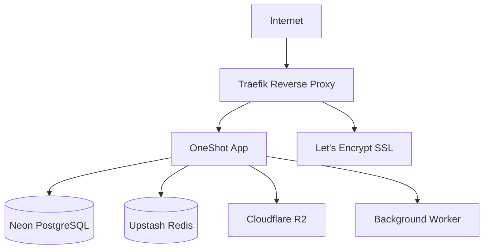
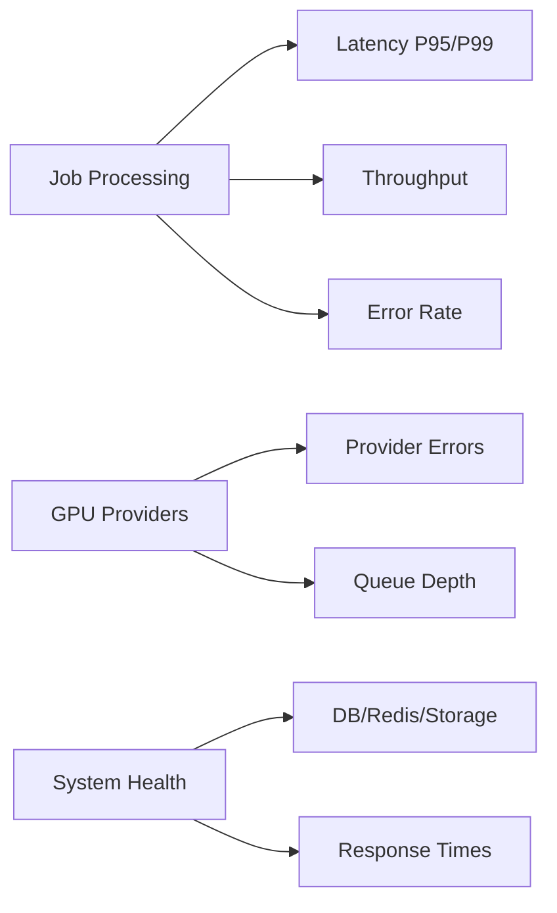

# OneShot Face Swapper Backend v2.0 (Production Ready)

A production-ready FastAPI backend for AI-powered face swapping with advanced features including real GPU inference integration, provider abstraction, comprehensive security, and extensive testing.

## Features

### 🚀 **Production Features v2.0 - GPU Integration**
- **Real GPU Processing**: ComfyUI local and RunPod serverless provider integration
- **Provider Abstraction**: Switchable GPU providers (ComfyUI Local, RunPod Serverless)
- **Advanced Security**: Comprehensive image validation, size limits, MIME type checking, magic byte verification
- **Idempotency & Caching**: SHA256-based deduplication prevents duplicate processing
- **Retry Logic**: Exponential backoff retry with configurable delays (15s, 60s)
- **Webhook System**: HMAC-SHA256 signed webhooks with retry mechanism
- **Pipeline Validation**: Pydantic-based parameter validation for all AI operations
- **S3 Integration**: Secure file upload/download with temporary file handling

### 🏗️ **Advanced Production Features (v2.0)**
- **Queue & GPU Integration**: Celery + Redis background job processing with real GPU providers
- **Realistic Pipeline Parameters**: Advanced job validation with face restoration, upscaling, and custom parameters
- **Rate Limiting**: IP and user-based rate limiting with slowapi and Redis backend
- **Monitoring & Logging**: Prometheus metrics, structured JSON logging with correlation IDs
- **Security & Validation**: Comprehensive input validation, file type checking, and error handling
- **Docker & Local Development**: Full Docker Compose setup with Redis and Celery workers
- **Comprehensive Testing**: 100+ tests with pytest, coverage reporting, E2E tests with mock providers

### 🔧 **Core Backend Features**
- **FastAPI Framework**: Async REST API with automatic OpenAPI documentation
- **Database**: SQLModel ORM with Alembic migrations
- **Authentication**: JWT-based auth with bcrypt password hashing
- **File Storage**: AWS S3 integration with presigned URLs
- **Payments & Entitlements**: Superwall integration with subscription plans and usage limits
- **AI Processing**: Modular AI pipeline for face swapping, restoration, and upscaling

## Repository Layout

- `backend/` - FastAPI backend, infrastructure scripts, and operations tooling
- `backend/data/` - Local development artifacts (e.g., SQLite dev database)
- `frontend/expo-app/` - Expo-based mobile client
- `frontend/oneshot-sdk/` - Shared TypeScript SDK consumed by the Expo app
- `frontend/tools/` - Verification and regression scripts for mobile and SDK fixes
- `frontend/docs/` - Frontend-focused documentation and playbooks

## Quick Start

### Using Docker (Recommended)

1. **Clone and setup:**
```bash
git clone <repository-url>
cd qoder-deneme/backend
cp .env.example .env
```

2. **Start all services:**
```bash
make docker-up
```

3. **Access the application:**
- API: http://localhost:8000
- Documentation: http://localhost:8000/docs
- Metrics: http://localhost:8000/metrics
- Prometheus: http://localhost:9090

> All backend commands run from the `backend/` directory.

### Local Development Setup

1. **Install dependencies:**
```bash
make install
```

2. **Setup database:**
```bash
make migrate
```

3. **Start Redis (required for rate limiting and Celery):**
```bash
# Option 1: Using Docker
docker run -d -p 6379:6379 redis:7-alpine

# Option 2: Install Redis locally
# Windows: Download from https://github.com/microsoftarchive/redis/releases
# macOS: brew install redis
# Linux: apt-get install redis-server
```

4. **Start development servers:**
```bash
# Terminal 1: API server
make dev

# Terminal 2: Celery worker
make worker
```

## Available Commands

### Development
```bash
make install     # Install dependencies
make dev        # Start development server
make worker     # Start Celery worker
make migrate    # Run database migrations
make setup      # Full development setup (install + migrate)
```

### Testing
```bash
make test       # Run tests
make coverage   # Run tests with coverage report
make test-e2e   # Run E2E tests with mock providers
```

### CI/CD & Deployment 🚀
```bash
# Deploy to environments
make deploy:staging          # Deploy to staging
make deploy:production       # Deploy to production

# Rollback deployments
make rollback:staging        # Rollback staging
make rollback:production     # Rollback production

# Smoke testing
make smoke-test:staging      # Test staging deployment
make smoke-test:production   # Test production deployment

# Deployment status
make deploy:status           # Check deployment history
```

### E2E Testing with Mock Providers

The project includes comprehensive end-to-end tests using mock GPU providers:

```bash
# Run all E2E tests
pytest tests/test_e2e_* -v

# Run specific test categories
pytest tests/test_e2e_job_processing.py -v       # Job processing workflows
pytest tests/test_e2e_provider_integration.py -v # Provider switching

# Run with coverage
pytest tests/test_e2e_* --cov=apps --cov-report=html

# Run specific test scenarios
pytest -k "test_face_restore_success" -v         # Face restoration
pytest -k "test_idempotency_cache_hit" -v        # Cache testing
pytest -k "test_webhook_notifications" -v        # Webhook testing
```

**Test Coverage:**
- Face restoration, face swap, and upscale workflows
- Provider switching (ComfyUI ↔ RunPod)
- Idempotency and caching mechanisms
- Retry logic and error handling
- Security validation and input filtering
- Webhook notifications with HMAC signatures
- Job cancellation workflows

### Docker
```bash
make docker-up   # Start all services
make docker-down # Stop all services
make logs        # Show Docker logs
```

### Utilities
```bash
make clean      # Clean cache files
make health     # Check service health
```

## API Documentation

### Authentication Endpoints
- `POST /api/v1/auth/login` - User login
- `GET /api/v1/auth/me` - Get current user info

### Job Management
- `POST /api/v1/jobs` - Create new face swap job
- `GET /api/v1/jobs/{job_id}` - Get job status
- `GET /api/v1/jobs` - List user jobs
- `GET /api/v1/jobs/limits` - Get user plan limits and usage

### File Upload
- `POST /api/v1/uploads/presign` - Generate presigned S3 URL

### Payments & Entitlements
- `POST /api/v1/webhooks/superwall` - Superwall webhook for subscription events
- `POST /api/v1/billing/mock_event` - Mock billing event (development only)

### Billing
- `POST /api/v1/billing/validate` - Validate App Store/Play Store receipts

### Monitoring
- `GET /health` - Health check
- `GET /metrics` - Prometheus metrics

## Configuration

### Environment Variables

Create a `.env` file in the root directory:

```env
# Database
DATABASE_URL=sqlite:///./oneshot_dev.db

# Redis (for rate limiting and Celery)
REDIS_URL=redis://localhost:6379/0

# JWT Authentication
JWT_SECRET=your-super-secret-key-change-in-production
JWT_ALGORITHM=HS256
JWT_EXPIRATION_HOURS=24

# AWS S3 (for file storage)
S3_BUCKET=your-bucket-name
S3_KEY=your-aws-access-key
S3_SECRET=your-aws-secret-key
S3_REGION=us-east-1

# GPU Provider Configuration
GPU_PROVIDER=comfy_local  # Options: comfy_local, runpod

# ComfyUI Local Configuration
COMFY_LOCAL_URL=http://localhost:8188

# RunPod Configuration
RUNPOD_API_KEY=your-runpod-api-key
RUNPOD_ENDPOINT_ID=your-runpod-endpoint-id

# Output Configuration
OUTPUT_FORMAT=png  # Options: png, jpeg
OUTPUT_QUALITY=95  # JPEG quality (1-100)
MAX_INPUT_MB=20    # Maximum input file size

# Security Configuration
MAX_IMAGE_DIMENSION=8192
MIN_IMAGE_DIMENSION=64

# Webhook Configuration
HMAC_SECRET=your-webhook-hmac-secret
WEBHOOK_TIMEOUT_SECONDS=30
WEBHOOK_RETRY_DELAYS=60,300,1800,7200  # 1m, 5m, 30m, 2h

# Application
ENVIRONMENT=development
SUPERWALL_SECRET=your-superwall-secret
DEFAULT_CREDITS=10
ALLOWED_ORIGINS=http://localhost:3000,http://localhost:8081
LOG_LEVEL=INFO

# Payments & Entitlements Configuration
SUPERWALL_SIGNING_SECRET=your-superwall-hmac-signing-secret
ENTITLEMENTS_DEFAULT_PLAN=free
DEV_BILLING_MODE=mock  # Options: mock, live
```

## 🚀 CI/CD & Deployment

OneShot Face Swapper includes a complete CI/CD pipeline with GitHub Actions, staging/production environments, and safe deployment practices.

### Quick Deployment

```bash
# Deploy to staging (one command)
make deploy:staging

# Deploy to production (with confirmation)
make deploy:production

# Rollback if needed
make rollback:staging
make rollback:production
```

### Pipeline Features

- ✅ **Automated Testing**: Unit tests, E2E tests, and coverage reporting
- ✅ **Multi-platform Builds**: Docker images for AMD64 and ARM64
- ✅ **Staging/Production**: Separate environments with approval workflows
- ✅ **Zero Downtime**: Blue-green deployments with health checks
- ✅ **Auto Rollback**: Automatic rollback on deployment failures
- ✅ **Smoke Tests**: Post-deployment validation with comprehensive checks
- ✅ **Security**: Secrets management and environment isolation

### Infrastructure



**Managed Services:**
- **Database**: Neon PostgreSQL (staging + production)
- **Cache/Queue**: Upstash Redis (serverless)
- **Storage**: Cloudflare R2 (S3-compatible)
- **SSL**: Let's Encrypt with Cloudflare DNS
- **Reverse Proxy**: Traefik with automatic HTTPS

### Setup Guide

1. **Configure GitHub Environments** (see [detailed guide](docs/github-environments-setup.md)):
   - Create `staging` and `production` environments
   - Add required secrets (database URLs, API keys, etc.)
   - Set deployment branch restrictions

2. **Configure Infrastructure**:
   ```bash
   # Copy environment templates
   cp deploy/staging/.env.example deploy/staging/.env
   cp deploy/production/.env.example deploy/production/.env
   
   # Edit with your actual values
   # - Domain names and SSL configuration
   # - Database and Redis URLs  
   # - API keys and secrets
   ```

3. **Deploy**:
   ```bash
   # Push to develop branch → triggers staging deployment
   git push origin develop
   
   # Push to main branch → triggers production deployment
   git push origin main
   ```

### Deployment Commands

```bash
# Manual deployments
make deploy:staging              # Deploy to staging
make deploy:production           # Deploy to production
make deploy:staging:full         # Deploy + smoke tests

# Rollback deployments  
make rollback:staging            # Rollback staging
make rollback:production         # Rollback production

# Testing deployments
make smoke-test:staging          # Test staging (Bash)
make smoke-test:production       # Test production (Bash)
make smoke-test:staging:ps       # Test staging (PowerShell)
make smoke-test:production:ps    # Test production (PowerShell)

# Deployment status
make deploy:status               # Check deployment history
```

### Smoke Test Coverage

Post-deployment validation includes:
- Health and readiness endpoints
- API documentation access
- Authentication and authorization
- CORS and security headers
- SSL/TLS configuration
- Database connectivity
- Performance benchmarks

**Learn More**: See [CI/CD Deployment Guide](docs/ci-cd-deployment-guide.md) for complete setup instructions.

## 📊 Monitoring & Alerts

OneShot Face Swapper includes comprehensive monitoring, tracing, and alerting capabilities for production-ready observability.

### Repository Layout

- `backend/` - FastAPI backend, infrastructure scripts, and operations tooling
- `backend/data/` - Local development artifacts (e.g., SQLite dev database)
- `frontend/expo-app/` - Expo-based mobile client
- `frontend/oneshot-sdk/` - Shared TypeScript SDK consumed by the Expo app
- `frontend/tools/` - Verification and regression scripts for mobile and SDK fixes
- `frontend/docs/` - Frontend-focused documentation and playbooks

## Quick Start

```bash
# Start complete monitoring stack
make monitor:setup

# Test monitoring endpoints
make monitor:test

# Generate test alerts (dry-run)
make monitor:test-alerts
```

### Monitoring Stack

- ✅ **Sentry**: Exception tracking and performance monitoring
- ✅ **Prometheus**: Metrics collection with custom job/provider metrics
- ✅ **Grafana**: Visualization dashboards for performance and health
- ✅ **Alertmanager**: Smart alerting with Slack/Email notifications
- ✅ **Health Checks**: Enhanced `/readyz` with dependency timings

### Key Metrics



**Job Metrics**:
- Job processing latency (P95/P99) by pipeline and provider
- Job throughput and completion rates
- Queue depth and concurrent job counts
- Provider-specific error rates and failure types

**System Metrics**:
- HTTP request rates and response times
- Database operation latencies
- Health check timings for all dependencies
- Cache hit rates and performance

### Alerting Rules

| Alert | Threshold | Duration | Severity |
|-------|-----------|----------|----------|
| High 5xx Error Rate | > 2% | 5m | Critical |
| High Job Latency (P95) | > 30s | 10m | Warning |
| High Queue Depth | > 100 jobs | 5m | Warning |
| Consecutive Provider Failures | > 5 failures | 2m | Critical |
| Database/Redis Down | Health check fails | 1-2m | Critical |

### Dashboards

**Performance Overview** ([JSON](ops/grafana/performance-dashboard.json)):
- Job processing latency percentiles
- Error rates and failure analysis
- Queue depth and throughput metrics
- GPU provider performance comparison

**System Health** ([JSON](ops/grafana/health-dashboard.json)):
- Service status indicators (DB/Redis/Storage/GPU)
- Health check response times
- HTTP endpoint performance
- Active user metrics

### Setup & Configuration

1. **Configure Monitoring Environment**:
   ```bash
   # Add to .env
   SENTRY_DSN=https://your-sentry-dsn@sentry.io/project-id
   SENTRY_TRACES_SAMPLE_RATE=0.1
   ENABLE_METRICS=true
   ```

2. **Start Monitoring Stack**:
   ```bash
   # Full setup with health checks
   make monitor:setup
   
   # Or start components individually
   make monitor:up     # Start all services
   make monitor:test   # Verify endpoints
   ```

3. **Access Dashboards**:
   - **Grafana**: http://localhost:3000 (admin/admin123)
   - **Prometheus**: http://localhost:9090
   - **Alertmanager**: http://localhost:9093

### Alert Configuration

**Slack Integration**:
```yaml
# ops/alerts/alertmanager.yml
slack_configs:
  - api_url: 'https://hooks.slack.com/services/YOUR/SLACK/WEBHOOK'
    channel: '#alerts-critical'
    title: '🚨 Critical Alert'
```

**Email Notifications**:
```yaml
email_configs:
  - to: 'oncall@yourdomain.com'
    subject: '🚨 CRITICAL: {{ .CommonAnnotations.summary }}'
```

### Health Endpoints

- **`/healthz`**: Basic health check (always returns healthy)
- **`/readyz`**: Comprehensive readiness with dependency checks
- **`/metrics`**: Prometheus metrics endpoint

**Enhanced `/readyz` Response**:
```json
{
  "healthy": true,
  "timestamp": 1696123456.789,
  "total_duration_ms": 245.67,
  "services": {
    "database": {
      "healthy": true,
      "duration_ms": 45.2,
      "details": {"connection": "ok", "query_test": "passed"}
    },
    "redis": {"healthy": true, "duration_ms": 12.1},
    "storage": {"healthy": true, "duration_ms": 156.8},
    "provider": {"healthy": true, "duration_ms": 31.5}
  }
}
```

### Testing & Validation

```bash
# Run monitoring tests
pytest tests/test_monitoring.py -v

# Generate test alerts (safe dry-run)
make monitor:test-alerts

# Monitor endpoints health
make monitor:test

# View monitoring logs
make monitor:logs
```

### Production Considerations

- **Sentry Sampling**: Set appropriate trace sampling rates (default: 10%)
- **Metrics Retention**: Prometheus retains 30 days of metrics
- **Alert Fatigue**: Use inhibition rules to prevent spam
- **Dashboard Optimization**: Use template variables for environment filtering
- **Security**: Secure Grafana with authentication in production

## GPU Provider Setup

### ComfyUI Local Setup

1. **Install ComfyUI with Docker:**
```bash
# Clone ComfyUI
git clone https://github.com/comfyanonymous/ComfyUI.git
cd ComfyUI

# Build Docker image
docker build -t comfyui .

# Run ComfyUI server
docker run --gpus all -p 8188:8188 -v $(pwd):/workspace comfyui
```

2. **Alternative: Manual Installation:**
```bash
# Install Python dependencies
pip install torch torchvision torchaudio --index-url https://download.pytorch.org/whl/cu121
pip install -r requirements.txt

# Start ComfyUI server
python main.py --listen 0.0.0.0 --port 8188
```

3. **Verify ComfyUI is running:**
```bash
curl http://localhost:8188/system_stats
```

### RunPod Serverless Setup

1. **Create RunPod Account:**
   - Sign up at https://runpod.io
   - Add payment method for serverless billing

2. **Create Serverless Endpoint:**
   - Go to Serverless dashboard
   - Click "New Endpoint"
   - Choose "ComfyUI" template or custom image
   - Configure:
     - **Name**: `comfyui-faceswap`
     - **Docker Image**: `runpod/comfyui:latest`
     - **GPU Type**: RTX 4090 or A100
     - **Container Disk**: 20GB
     - **Volume Mount**: `/workspace`

3. **Get Endpoint Configuration:**
   - Copy **Endpoint ID** to `RUNPOD_ENDPOINT_ID`
   - Copy **API Key** to `RUNPOD_API_KEY`

4. **Test RunPod Connection:**
```bash
curl -X POST https://api.runpod.ai/v2/{ENDPOINT_ID}/runsync \
     -H "Authorization: Bearer {API_KEY}" \
     -H "Content-Type: application/json" \
     -d '{"input":{"workflow":{"test":"connection"}}}'
```

### Provider Selection

Choose your provider in `.env`:

```env
# For local ComfyUI (free, requires local GPU)
GPU_PROVIDER=comfy_local
COMFY_LOCAL_URL=http://localhost:8188

# For RunPod serverless (pay-per-use, cloud GPU)
GPU_PROVIDER=runpod
RUNPOD_API_KEY=your-api-key
RUNPOD_ENDPOINT_ID=your-endpoint-id
```

## Payments & Entitlements Integration

The backend includes a comprehensive payments and entitlements system integrated with Superwall for subscription management.

### Features

- **Subscription Management**: Automatic handling of subscription events via webhooks
- **Plan-based Limits**: Different job limits and parameter restrictions per plan
- **Usage Tracking**: Daily usage aggregates with automatic reset
- **HMAC Security**: Webhook signature verification for security
- **Idempotent Processing**: Duplicate event prevention using event IDs

### Subscription Plans

| Plan | Daily Jobs | Concurrent Jobs | Max Side Parameter | Features |
|------|------------|-----------------|-------------------|----------|
| Free | 5 | 2 | 512px | Basic processing |
| Pro | 50 | 5 | 1024px | Enhanced processing, priority queue |
| Premium | 200 | 10 | 2048px | All features, highest priority |

### Setup

1. **Configure Superwall Integration:**
   - Set `SUPERWALL_SIGNING_SECRET` in your environment
   - Configure webhook URL in Superwall dashboard: `https://your-domain.com/api/v1/webhooks/superwall`

2. **Initialize Default Plans:**
   ```bash
   make bootstrap
   ```

3. **Verify Configuration:**
   ```bash
   curl http://localhost:8000/api/v1/jobs/limits \
        -H "Authorization: Bearer YOUR_JWT_TOKEN"
   ```

### Manual QA Testing

#### Test Webhook Processing

1. **Valid Superwall Webhook:**
   ```bash
   # Calculate HMAC signature (use online tool or script)
   PAYLOAD='{"event_type":"subscription_created","event_id":"evt_123","user_id":"user_456","product_id":"pro_monthly","status":"active","expires_at":"2024-12-31T23:59:59Z"}'
   SIGNATURE=$(echo -n "$PAYLOAD" | openssl dgst -sha256 -hmac "your-superwall-signing-secret" -binary | base64)
   
   curl -X POST "http://localhost:8000/api/v1/webhooks/superwall" \
        -H "Content-Type: application/json" \
        -H "X-Superwall-Signature: $SIGNATURE" \
        -d "$PAYLOAD"
   ```
   
   **Expected Response:**
   ```json
   {
     "status": "success",
     "event_id": "evt_123",
     "processed": true
   }
   ```

2. **Invalid Signature (should fail):**
   ```bash
   curl -X POST "http://localhost:8000/api/v1/webhooks/superwall" \
        -H "Content-Type: application/json" \
        -H "X-Superwall-Signature: invalid_signature" \
        -d '{"event_type":"subscription_created","user_id":"user_456"}'
   ```
   
   **Expected Response:** 401 Unauthorized

3. **Idempotent Processing (duplicate event):**
   ```bash
   # Send the same webhook twice with same event_id
   # Second request should return success but not process again
   ```

#### Test Daily Limits

1. **Check User Limits:**
   ```bash
   curl "http://localhost:8000/api/v1/jobs/limits" \
        -H "Authorization: Bearer YOUR_JWT_TOKEN"
   ```
   
   **Expected Response:**
   ```json
   {
     "plan_code": "free",
     "limits": {
       "daily_jobs": 5,
       "concurrent_jobs": 2,
       "max_side": 512
     },
     "usage": {
       "jobs_today": 2,
       "concurrent_jobs": 0
     },
     "remaining": {
       "daily_jobs": 3,
       "concurrent_jobs": 2
     }
   }
   ```

2. **Test Daily Limit Exceeded (429 Error):**
   ```bash
   # Create jobs until daily limit is reached
   for i in {1..6}; do
     curl -X POST "http://localhost:8000/api/v1/jobs" \
          -H "Authorization: Bearer YOUR_JWT_TOKEN" \
          -H "Content-Type: application/json" \
          -d '{
            "job_type": "face_restore",
            "params": {
              "input_url": "https://example.com/test.jpg",
              "face_restore": "gfpgan",
              "max_side": 512
            }
          }'
     echo "Job $i created"
   done
   ```
   
   **6th job should return:**
   ```json
   {
     "detail": "Daily job limit exceeded (5/5). Please upgrade your plan or wait until tomorrow.",
     "error_code": "DAILY_LIMIT_EXCEEDED"
   }
   ```
   **Status Code:** 429 Too Many Requests

3. **Test Parameter Violation (422 Error):**
   ```bash
   curl -X POST "http://localhost:8000/api/v1/jobs" \
        -H "Authorization: Bearer YOUR_JWT_TOKEN" \
        -H "Content-Type: application/json" \
        -d '{
          "job_type": "face_restore",
          "params": {
            "input_url": "https://example.com/test.jpg",
            "face_restore": "gfpgan",
            "max_side": 1024
          }
        }'
   ```
   
   **Expected Response (for free plan):**
   ```json
   {
     "detail": "Parameter 'max_side' value 1024 exceeds plan limit of 512",
     "error_code": "PARAMETER_VIOLATION"
   }
   ```
   **Status Code:** 422 Unprocessable Entity

4. **Test Payment Required (402 Error):**
   ```bash
   # Try to use a premium feature on free plan
   curl -X POST "http://localhost:8000/api/v1/jobs" \
        -H "Authorization: Bearer YOUR_JWT_TOKEN" \
        -H "Content-Type: application/json" \
        -d '{
          "job_type": "face_swap",
          "params": {
            "src_face_url": "https://example.com/source.jpg",
            "target_url": "https://example.com/target.jpg",
            "premium_feature": true
          }
        }'
   ```
   
   **Expected Response:**
   ```json
   {
     "detail": "This feature requires a Pro or Premium subscription",
     "error_code": "PAYMENT_REQUIRED"
   }
   ```
   **Status Code:** 402 Payment Required

#### Test Mock Billing Events (Development)

1. **Trigger Subscription Creation:**
   ```bash
   curl -X POST "http://localhost:8000/api/v1/billing/mock_event" \
        -H "Content-Type: application/json" \
        -d '{
          "event_type": "subscription_created",
          "user_id": "test_user_123",
          "product_id": "pro_monthly"
        }'
   ```
   
   **Expected Response:**
   ```json
   {
     "status": "success",
     "message": "Mock event sent to webhook",
     "webhook_response": {
       "status": "success",
       "event_id": "mock_evt_789",
       "processed": true
     }
   }
   ```

2. **Trigger Subscription Cancellation:**
   ```bash
   curl -X POST "http://localhost:8000/api/v1/billing/mock_event" \
        -H "Content-Type: application/json" \
        -d '{
          "event_type": "subscription_cancelled",
          "user_id": "test_user_123",
          "product_id": "pro_monthly"
        }'
   ```

### Testing Payments Integration

1. **Run Payment Tests:**
   ```bash
   # Run all payment-related tests
   pytest tests/test_payments_*.py -v
   
   # Run specific test categories
   pytest tests/test_payments_webhooks.py -v
   pytest tests/test_entitlements.py -v
   
   # Run with coverage
   pytest tests/test_payments_*.py --cov=apps.api.services.entitlements --cov=apps.api.routers.webhooks --cov-report=html
   ```

2. **Expected Test Coverage:**
   - Webhook signature validation (valid/invalid)
   - Idempotent event processing
   - Daily limit enforcement
   - Parameter validation per plan
   - Concurrent job limits
   - Plan upgrades/downgrades
   - Usage tracking accuracy

### Troubleshooting Payments

#### Common Issues:

1. **Webhook Signature Verification Failed:**
   - Verify `SUPERWALL_SIGNING_SECRET` matches Superwall dashboard
   - Ensure payload is sent exactly as received (no modifications)
   - Check signature generation algorithm (HMAC-SHA256)

2. **User Entitlements Not Found:**
   ```bash
   # Check if user has entitlements
   # Connect to database and run:
   SELECT * FROM user_entitlements WHERE user_id = 'your_user_id';
   
   # If empty, user will use default plan (free)
   ```

3. **Daily Limits Not Reset:**
   ```bash
   # Check usage aggregates table
   SELECT * FROM usage_aggregates WHERE user_id = 'your_user_id' ORDER BY date DESC;
   
   # Manually reset for testing:
   DELETE FROM usage_aggregates WHERE user_id = 'your_user_id' AND date = CURRENT_DATE;
   ```

4. **Mock Billing Not Working:**
   - Ensure `DEV_BILLING_MODE=mock` in environment
   - Check that webhook endpoint is accessible
   - Verify API server is running on correct port

#### Debug Commands:

```bash
# Check entitlements service
curl "http://localhost:8000/api/v1/jobs/limits" \
     -H "Authorization: Bearer YOUR_JWT_TOKEN"

# View subscription status
# Connect to database:
SELECT s.*, ue.plan_code, ue.limits_json 
FROM subscriptions s 
JOIN user_entitlements ue ON s.user_id = ue.user_id 
WHERE s.user_id = 'your_user_id';

# Check daily usage
SELECT * FROM usage_aggregates 
WHERE user_id = 'your_user_id' 
AND date >= CURRENT_DATE - INTERVAL '7 days';

# Test webhook signature generation
echo -n 'your_payload' | openssl dgst -sha256 -hmac 'your_secret' -binary | base64
```

### Database Schema

The payments system adds three new tables:

```sql
-- Subscription records from Superwall
CREATE TABLE subscriptions (
    id UUID PRIMARY KEY,
    user_id UUID NOT NULL,
    product_id VARCHAR NOT NULL,
    status VARCHAR NOT NULL,
    expires_at TIMESTAMP,
    event_id VARCHAR UNIQUE NOT NULL,
    raw_payload_json TEXT,
    created_at TIMESTAMP DEFAULT NOW(),
    updated_at TIMESTAMP DEFAULT NOW()
);

-- User entitlements (active plans)
CREATE TABLE user_entitlements (
    id UUID PRIMARY KEY,
    user_id UUID NOT NULL,
    plan_code VARCHAR NOT NULL,
    limits_json TEXT NOT NULL,
    effective_from TIMESTAMP NOT NULL,
    effective_to TIMESTAMP,
    created_at TIMESTAMP DEFAULT NOW(),
    UNIQUE(user_id, effective_from)
);

-- Daily usage tracking
CREATE TABLE usage_aggregates (
    id UUID PRIMARY KEY,
    user_id UUID NOT NULL,
    date DATE NOT NULL,
    jobs_created INTEGER DEFAULT 0,
    created_at TIMESTAMP DEFAULT NOW(),
    updated_at TIMESTAMP DEFAULT NOW(),
    UNIQUE(user_id, date)
);
```

## Manual E2E Testing Guide

### Prerequisites

1. **Setup environment:**
```bash
# Copy and configure environment
cp .env.example .env
# Edit .env with your provider settings

# Start services
make docker-up
# OR for local development:
make dev  # Terminal 1
make worker  # Terminal 2
```

2. **Verify services are running:**
```bash
# Check API health
curl http://localhost:8000/health

# Check if worker is connected
# Should see worker in logs
```

### Test Scenarios

#### Scenario 1: Face Restoration (ComfyUI Local)

1. **Configure for ComfyUI:**
```env
GPU_PROVIDER=comfy_local
COMFY_LOCAL_URL=http://localhost:8188
```

2. **Upload test image:**
```bash
curl -X POST "http://localhost:8000/api/v1/uploads/presign" \
     -H "Content-Type: application/json" \
     -d '{
       "filename": "test-face.jpg",
       "content_type": "image/jpeg"
     }'
```

Response:
```json
{
  "upload_url": "https://s3.amazonaws.com/bucket/presigned-url",
  "file_url": "https://s3.amazonaws.com/bucket/test-face.jpg"
}
```

3. **Upload image to S3 URL:**
```bash
# Use the upload_url from previous response
curl -X PUT "$UPLOAD_URL" \
     -H "Content-Type: image/jpeg" \
     --data-binary @/path/to/your/test-face.jpg
```

4. **Create face restoration job:**
```bash
curl -X POST "http://localhost:8000/api/v1/jobs" \
     -H "Content-Type: application/json" \
     -d '{
       "job_type": "face_restore",
       "params": {
         "input_url": "https://s3.amazonaws.com/bucket/test-face.jpg",
         "face_restore": "gfpgan",
         "enhance": true,
         "max_side": 1024,
         "denoise": 0.5
       }
     }'
```

Response:
```json
{
  "id": "job_123456",
  "status": "pending",
  "job_type": "face_restore",
  "created_at": "2024-01-15T10:30:00Z"
}
```

5. **Monitor job progress:**
```bash
# Poll job status every 5 seconds
while true; do
  curl "http://localhost:8000/api/v1/jobs/job_123456" | jq '.status,.progress'
  sleep 5
  if [ "$(curl -s http://localhost:8000/api/v1/jobs/job_123456 | jq -r '.status')" = "succeeded" ]; then
    break
  fi
done
```

Expected progression:
```
pending → running (10%) → running (50%) → running (90%) → succeeded (100%)
```

6. **Get results:**
```bash
curl "http://localhost:8000/api/v1/jobs/job_123456" | jq '.artifacts[].output_url'
```

7. **Download and view result:**
```bash
# Copy the output URL and open in browser
# OR download with curl:
curl -o restored-face.png "$OUTPUT_URL"
```

#### Scenario 2: Face Swap (RunPod Serverless)

1. **Configure for RunPod:**
```env
GPU_PROVIDER=runpod
RUNPOD_API_KEY=your-api-key
RUNPOD_ENDPOINT_ID=your-endpoint-id
```

2. **Upload source and target images:**
```bash
# Upload source face
curl -X POST "http://localhost:8000/api/v1/uploads/presign" \
     -d '{"filename": "source-face.jpg", "content_type": "image/jpeg"}'
# Upload to returned presigned URL

# Upload target image
curl -X POST "http://localhost:8000/api/v1/uploads/presign" \
     -d '{"filename": "target-image.jpg", "content_type": "image/jpeg"}'
# Upload to returned presigned URL
```

3. **Create face swap job:**
```bash
curl -X POST "http://localhost:8000/api/v1/jobs" \
     -H "Content-Type: application/json" \
     -d '{
       "job_type": "face_swap",
       "params": {
         "src_face_url": "https://s3.amazonaws.com/bucket/source-face.jpg",
         "target_url": "https://s3.amazonaws.com/bucket/target-image.jpg",
         "lora": null,
         "blend": 0.8,
         "max_side": 1024
       }
     }'
```

4. **Monitor and download result** (same as Scenario 1)

#### Scenario 3: Upscaling with Tile Processing

```bash
curl -X POST "http://localhost:8000/api/v1/jobs" \
     -H "Content-Type: application/json" \
     -d '{
       "job_type": "upscale",
       "params": {
         "input_url": "https://s3.amazonaws.com/bucket/low-res.jpg",
         "model": "realesrgan_x4plus",
         "scale": 4,
         "tile": 256
       }
     }'
```

#### Scenario 4: Idempotency Test (Cache Hit)

1. **Create job with identical parameters:**
```bash
# Submit the exact same face_restore job again
curl -X POST "http://localhost:8000/api/v1/jobs" \
     -H "Content-Type: application/json" \
     -d '{
       "job_type": "face_restore",
       "params": {
         "input_url": "https://s3.amazonaws.com/bucket/test-face.jpg",
         "face_restore": "gfpgan",
         "enhance": true,
         "max_side": 1024,
         "denoise": 0.5
       }
     }'
```

2. **Expected behavior:**
   - Job should complete almost instantly (< 5 seconds)
   - Status should go: `pending → succeeded`
   - No actual GPU processing should occur
   - Result should be identical to previous job

#### Scenario 5: Job Cancellation

1. **Start a long-running job:**
```bash
JOB_ID=$(curl -X POST "http://localhost:8000/api/v1/jobs" \
     -H "Content-Type: application/json" \
     -d '{
       "job_type": "upscale",
       "params": {
         "input_url": "https://s3.amazonaws.com/bucket/large-image.jpg",
         "model": "realesrgan_x4plus",
         "scale": 4
       }
     }' | jq -r '.id')
```

2. **Cancel the job while running:**
```bash
# Wait for job to start processing
sleep 10

# Cancel the job
curl -X POST "http://localhost:8000/api/v1/jobs/$JOB_ID/cancel"
```

3. **Verify cancellation:**
```bash
curl "http://localhost:8000/api/v1/jobs/$JOB_ID" | jq '.status'
# Should return: "cancelled"
```

### Expected Results

#### Successful Job Response:
```json
{
  "id": "job_123456",
  "user_id": "user_789",
  "job_type": "face_restore",
  "status": "succeeded",
  "progress": 100,
  "created_at": "2024-01-15T10:30:00Z",
  "started_at": "2024-01-15T10:30:05Z",
  "finished_at": "2024-01-15T10:31:30Z",
  "params": {
    "input_url": "https://s3.amazonaws.com/bucket/test-face.jpg",
    "face_restore": "gfpgan",
    "enhance": true,
    "max_side": 1024,
    "denoise": 0.5
  },
  "artifacts": [
    {
      "id": "artifact_456",
      "artifact_type": "image",
      "output_url": "https://s3.amazonaws.com/bucket/outputs/restored_face.png",
      "file_size": 1048576,
      "mime_type": "image/png"
    }
  ]
}
```

#### Performance Benchmarks:
- **ComfyUI Local**: 30-90 seconds per job (depends on GPU)
- **RunPod Serverless**: 45-120 seconds per job (includes cold start)
- **Cache Hit**: < 5 seconds
- **File Upload**: < 10 seconds for 5MB images

### Troubleshooting

#### Common Issues:

1. **"Provider not available" error:**
   - Check GPU_PROVIDER setting in .env
   - Verify ComfyUI is running on correct port
   - Test RunPod API key and endpoint ID

2. **"Input validation failed" error:**
   - Verify image URL is accessible
   - Check image format (JPEG, PNG, WebP supported)
   - Ensure image size < 20MB

3. **Job stuck in "pending" status:**
   - Check Celery worker is running
   - Verify Redis connection
   - Check worker logs for errors

4. **"Webhook delivery failed" warning:**
   - This is normal if no webhook URL is configured
   - Set webhook URL in job creation or ignore warnings

#### Debug Commands:

```bash
# Check service health
curl http://localhost:8000/health

# View API logs
docker logs oneshot-api

# View worker logs
docker logs oneshot-worker

# Check Redis connection
redis-cli ping

# Test ComfyUI
curl http://localhost:8188/system_stats

# Test S3 connectivity
aws s3 ls s3://your-bucket-name
```

### Rate Limiting

The API implements multiple levels of rate limiting:

- **Global Rate Limiting**: 30 requests/minute per IP
- **User Rate Limiting**: Based on subscription plan
  - Free: 5 jobs/day
  - Pro: 50 jobs/day
  - Premium: 200 jobs/day

### Job Parameters

Advanced job creation with comprehensive validation:

```json
{
  "source_url": "https://s3.bucket/source.jpg",
  "target_url": "https://s3.bucket/target.jpg",
  "job_type": "face_swap",
  "params": {
    "face_restore": true,
    "upscale": 2,
    "swap_strength": 0.8,
    "blend_ratio": 0.5,
    "face_enhancer": "gfpgan"
  }
}
```

### Monitoring & Logging

**Structured Logging:**
- JSON format with correlation IDs
- User ID and job ID tracking
- Performance metrics
- Error tracking with stack traces

**Prometheus Metrics:**
- HTTP request metrics
- Job processing metrics
- User activity metrics
- System resource usage

**Example log output:**
```json
{
  "timestamp": "2025-09-17T15:30:45.123Z",
  "level": "info",
  "event": "job_created",
  "job_id": "550e8400-e29b-41d4-a716-446655440000",
  "user_id": "123e4567-e89b-12d3-a456-426614174000",
  "job_type": "face_swap",
  "processing_time_ms": 1250
}
```

## Testing

The project includes comprehensive test coverage:

### Test Categories
- **Unit Tests**: Individual component testing
- **Integration Tests**: End-to-end workflow testing
- **Rate Limiting Tests**: Rate limit validation
- **Authentication Tests**: Auth flow testing
- **Error Handling Tests**: Edge case validation

### Running Tests
```bash
# Run all tests
make test

# Run with coverage
make coverage

# Run specific test file
python -m pytest tests/test_auth.py -v

# Run specific test
python -m pytest tests/test_auth.py::TestAuth::test_login_success -v
```

### Test Coverage
The project maintains 80%+ test coverage across all modules.

## Deployment

### Production Deployment

1. **Environment Setup:**
```bash
# Update environment variables
cp .env.example .env.production
# Edit .env.production with production values
```

2. **Database Migration:**
```bash
docker-compose exec api alembic upgrade head
```

3. **Health Check:**
```bash
curl http://localhost:8000/health
curl http://localhost:8000/metrics
```

### Scaling

- **API**: Scale horizontally with load balancer
- **Workers**: Scale Celery workers based on queue length
- **Database**: Use PostgreSQL with connection pooling
- **Redis**: Use Redis Cluster for high availability

## Development Guide

### Project Structure
```
qoder-deneme/
├── apps/
│   ├── api/
│   │   ├── main.py           # FastAPI application
│   │   └── routers/          # API route handlers
│   ├── core/
│   │   ├── settings.py       # Configuration
│   │   └── security.py       # Authentication
│   ├── db/
│   │   ├── models/           # Database models
│   │   └── session.py        # Database session
│   ├── services/             # Business logic
│   └── worker/
│       └── tasks.py          # Background tasks
├── tests/                    # Test suite
├── alembic/                  # Database migrations
├── docker-compose.yml        # Docker services
├── Dockerfile               # Container image
├── Makefile                 # Development commands
└── requirements.txt         # Python dependencies
```

### Adding New Features

1. **Create Database Model** (if needed):
```python
# apps/db/models/new_model.py
class NewModel(SQLModel, table=True):
    __tablename__ = "new_models"
    id: Optional[UUID] = Field(default_factory=uuid4, primary_key=True)
    # Add fields...
```

2. **Create Migration:**
```bash
alembic revision --autogenerate -m "Add new model"
alembic upgrade head
```

3. **Add API Endpoint:**
```python
# apps/api/routers/new_router.py
@router.post("/new-endpoint")
async def new_endpoint(data: NewSchema):
    # Implementation...
```

4. **Add Tests:**
```python
# tests/test_new_feature.py
def test_new_endpoint(client, auth_headers):
    response = client.post("/api/v1/new-endpoint", json=data)
    assert response.status_code == 200
```

### GPU Integration (Future)

The current implementation simulates GPU processing. To integrate real GPU processing:

1. **Replace simulation in `apps/worker/tasks.py`:**
```python
def process_job(job: Job) -> str:
    # Replace simulation with actual GPU calls
    # Example: RunPod API, ComfyUI, or local GPU processing
    pass
```

2. **Update Docker configuration** for GPU support:
```yaml
services:
  celery_worker:
    runtime: nvidia  # For NVIDIA GPU support
    environment:
      - NVIDIA_VISIBLE_DEVICES=all
```

## Troubleshooting

### Common Issues

**Redis Connection Error:**
```bash
# Start Redis
docker run -d -p 6379:6379 redis:7-alpine
# Or check if Redis is running
redis-cli ping
```

**Database Migration Issues:**
```bash
# Reset database
rm -f oneshot_dev.db
make migrate
```

**Port Already in Use:**
```bash
# Find process using port 8000
lsof -i :8000  # macOS/Linux
netstat -ano | findstr :8000  # Windows

# Kill process and restart
make docker-down
make docker-up
```

**Test Failures:**
```bash
# Install missing dependencies
pip install -r requirements.txt

# Check specific test
python -m pytest tests/test_auth.py::TestAuth::test_login_success -v -s
```

## Contributing

1. Fork the repository
2. Create a feature branch: `git checkout -b feature/new-feature`
3. Make changes and add tests
4. Run tests: `make test`
5. Submit a pull request

### Code Style
- Follow PEP 8
- Use type hints
- Add docstrings to public functions
- Maintain test coverage above 80%

## License

This project is licensed under the MIT License.

## Support

For issues and questions:
1. Check the troubleshooting section
2. Review existing GitHub issues
3. Create a new issue with detailed information

---

**OneShot Face Swapper Backend v2.0** - Production-ready AI processing with enterprise-level features.

AI-powered face swapping and restoration service built with FastAPI, featuring LoRA-based models (GFPGAN, CodeFormer) for face enhancement and upscaling.

## Features

- **Face Restoration**: Enhance image quality using GFPGAN and CodeFormer models
- **Face Swapping**: Replace faces using custom LoRA models
- **Image Upscaling**: Super-resolution processing
- **User Authentication**: JWT-based authentication system
- **Credit System**: Pay-per-use credit system
- **Subscription Management**: Superwall integration for payments
- **Background Processing**: Asynchronous job queue with Celery and Redis
- **S3 Storage**: AWS S3 integration for image storage

## Technology Stack

- **Framework**: FastAPI + SQLModel + Uvicorn
- **Database**: PostgreSQL with Alembic migrations
- **Job Queue**: Celery + Redis
- **Storage**: AWS S3
- **Authentication**: JWT with PassLib
- **AI Processing**: GFPGAN, CodeFormer, custom LoRA models

## Repository Layout

- `backend/` - FastAPI backend, infrastructure scripts, and operations tooling
- `backend/data/` - Local development artifacts (e.g., SQLite dev database)
- `frontend/expo-app/` - Expo-based mobile client
- `frontend/oneshot-sdk/` - Shared TypeScript SDK consumed by the Expo app
- `frontend/tools/` - Verification and regression scripts for mobile and SDK fixes
- `frontend/docs/` - Frontend-focused documentation and playbooks

## Quick Start

### Prerequisites

- Python 3.8+
- PostgreSQL
- Redis
- AWS S3 account

### Installation

1. **Clone the repository**
   ```bash
   git clone <repository-url>
   cd oneshot-backend
   ```

2. **Install dependencies**
   ```bash
   pip install -r requirements.txt
   ```

3. **Environment setup**
   ```bash
   cp .env.example .env
   # Edit .env file with your configuration
   ```

4. **Database setup**
   ```bash
   # Create database
   createdb oneshot_db
   
   # Run migrations
   alembic upgrade head
   ```

5. **Start services**
   
   **API Server:**
   ```bash
   python main.py
   ```
   
   **Background Worker:**
   ```bash
   celery -A apps.worker.tasks worker --loglevel=info
   ```
   
   **Task Scheduler (optional):**
   ```bash
   celery -A apps.worker.tasks beat --loglevel=info
   ```

## API Documentation

### Base URL
```
http://localhost:8000/api/v1
```

### Authentication

#### Register User
```http
POST /auth/register
Content-Type: application/json

{
  "email": "user@example.com",
  "password": "secure_password",
  "credits": 10
}
```

#### Login
```http
POST /auth/login
Content-Type: application/json

{
  "email": "user@example.com",
  "password": "secure_password"
}
```

#### Get User Profile
```http
GET /auth/me
Authorization: Bearer <token>
```

### File Upload

#### Generate Presigned URL
```http
POST /uploads/presign
Authorization: Bearer <token>
Content-Type: application/json

{
  "filename": "image.jpg",
  "content_type": "image/jpeg",
  "file_size": 1024000
}
```

### Job Processing

#### Create Job
```http
POST /jobs
Authorization: Bearer <token>
Content-Type: application/json

{
  "job_type": "face_restoration",
  "input_image_url": "https://s3.amazonaws.com/bucket/image.jpg",
  "parameters": {
    "model": "gfpgan",
    "scale_factor": 2
  }
}
```

#### Get Job Status
```http
GET /jobs/{job_id}
Authorization: Bearer <token>
```

#### Get User Jobs
```http
GET /jobs?skip=0&limit=10
Authorization: Bearer <token>
```

### Billing

#### Validate Receipt
```http
POST /billing/validate
Authorization: Bearer <token>
Content-Type: application/json

{
  "receipt_data": "base64_receipt_data",
  "product_id": "credits_50",
  "transaction_id": "unique_transaction_id"
}
```

## Configuration

### Environment Variables

| Variable | Description | Required |
|----------|-------------|----------|
| `DATABASE_URL` | PostgreSQL connection string | Yes |
| `JWT_SECRET` | JWT signing secret | Yes |
| `S3_BUCKET` | AWS S3 bucket name | Yes |
| `S3_KEY` | AWS access key ID | Yes |
| `S3_SECRET` | AWS secret access key | Yes |
| `REDIS_URL` | Redis connection URL | Yes |
| `SUPERWALL_SECRET` | Superwall API secret | Yes |

### Credit Costs

- Face Restoration: 1 credit
- Face Swap: 2 credits
- Upscaling: 1 credit

## Development

### Project Structure

```
oneshot-backend/
├── apps/
│   ├── api/                 # FastAPI application
│   │   ├── routers/         # API endpoints
│   │   ├── main.py          # App configuration
│   │   └── services.py      # Business logic
│   ├── worker/              # Background processing
│   │   ├── processors/      # AI processing modules
│   │   ├── tasks.py         # Celery tasks
│   │   └── main.py          # Worker entry point
│   ├── core/                # Core utilities
│   │   ├── config.py        # Configuration constants
│   │   ├── settings.py      # Application settings
│   │   ├── security.py      # Security utilities
│   │   └── exceptions.py    # Custom exceptions
│   └── db/                  # Database layer
│       ├── models/          # SQLModel definitions
│       ├── session.py       # Database session
│       └── base.py          # CRUD operations
├── alembic/                 # Database migrations
├── requirements.txt         # Python dependencies
├── main.py                  # Application entry point
└── .env                     # Environment variables
```

### Adding New Features

1. **New AI Processor**: Add to `apps/worker/processors/`
2. **New API Endpoint**: Add router to `apps/api/routers/`
3. **New Database Model**: Add to `apps/db/models/`
4. **New Background Task**: Add to `apps/worker/tasks.py`

### Testing

```bash
# Run tests
pytest

# Run with coverage
pytest --cov=apps
```

### Database Migrations

```bash
# Create migration
alembic revision --autogenerate -m "Description"

# Apply migration
alembic upgrade head

# Rollback migration
alembic downgrade -1
```

## Deployment

### Docker Deployment

1. **Build image**
   ```bash
   docker build -t oneshot-backend .
   ```

2. **Run with docker-compose**
   ```bash
   docker-compose up -d
   ```

### Production Considerations

- Use environment-specific settings
- Configure proper CORS origins
- Set up SSL/TLS certificates
- Configure reverse proxy (nginx)
- Set up monitoring and logging
- Configure auto-scaling for workers
- Set up database backups
- Configure S3 bucket policies

## Monitoring

- **Health Check**: `GET /health`
- **API Documentation**: `GET /docs` (development only)
- **Job Monitoring**: Check Celery worker logs
- **Database**: Monitor PostgreSQL performance
- **Storage**: Monitor S3 usage and costs

## Security

- JWT-based authentication
- Password hashing with bcrypt
- Input validation on all endpoints
- File upload validation
- CORS configuration
- Environment variable protection

## 🔒 Privacy & Content Safety

The OneShot Face Swapper system includes comprehensive privacy and content safety features to ensure responsible AI usage and protect user data.

### Privacy Features

#### Image Privacy
- **EXIF Metadata Stripping**: All uploaded images have EXIF metadata automatically removed to protect user privacy
- **Orientation Preservation**: Image orientation is preserved while removing sensitive metadata
- **Privacy Processing**: Comprehensive processing pipeline for secure image handling

#### Watermarking
- **Plan-Based Watermarks**: Watermarks are applied based on user subscription plans:
  - **Free Plan**: Watermarks always applied
  - **Pro Plan**: Watermarks optional (disabled by default)
  - **Premium Plan**: Full watermark customization
- **Customizable Positioning**: Multiple watermark positions (bottom-right, top-left, center, etc.)
- **Transparency Control**: Adjustable opacity and styling

#### Data Retention
- **Automatic Cleanup**: Old artifacts and job data are automatically deleted after the retention period
- **Configurable Retention**: Default 30-day retention, configurable via `RETENTION_DAYS`
- **S3 Integration**: Automatic deletion of stored files from S3/R2 storage
- **Comprehensive Cleanup**: Jobs, artifacts, and associated files are cleaned up together

### Content Safety

#### NSFW Detection
- **Heuristic Analysis**: Built-in NSFW detection using skin tone and content pattern analysis
- **Configurable Modes**:
  - `block`: Block NSFW content completely
  - `flag`: Flag NSFW content but allow processing
- **Plan-Based Policies**: Different sensitivity levels based on user plans

#### Face Consent Enforcement
- **Face Swap Gate**: Explicit consent required for face swap operations
- **Plan-Based Requirements**:
  - **Free**: Face swap consent + deepfake awareness consent
  - **Pro**: Face swap consent + biometric processing consent  
  - **Premium**: Face swap consent only
- **Commercial Use Control**: Additional restrictions for commercial usage

### Configuration

#### Privacy Environment Variables

| Variable | Description | Default |
|----------|-------------|----------|
| `RETENTION_DAYS` | Days to retain user data | 30 |
| `NSFW_MODE` | NSFW handling mode | "block" |
| `WATERMARK_DEFAULT` | Default watermark setting | true |
| `ENABLE_EXIF_STRIPPING` | Enable EXIF metadata removal | true |
| `ENABLE_WATERMARK` | Enable watermark functionality | true |
| `ENABLE_NSFW_DETECTION` | Enable NSFW content detection | true |
| `ENABLE_CONSENT_ENFORCEMENT` | Enable consent requirements | true |
| `NSFW_CONFIDENCE_THRESHOLD` | NSFW detection threshold | 0.7 |

### API Usage

#### Face Swap with Consent
```http
POST /jobs
Authorization: Bearer <token>
Content-Type: application/json

{
  "job_type": "face_swap",
  "input_image_url": "https://example.com/input.jpg",
  "target_image_url": "https://example.com/target.jpg",
  "parameters": {
    "face_swap_consent": true,
    "deepfake_awareness_consent": true,
    "blend_ratio": 0.8
  }
}
```

#### Content Safety Error Response
```json
{
  "detail": {
    "code": "consent_required",
    "message": "Face swap consent is required.",
    "required_consents": ["face_swap_consent", "deepfake_awareness_consent"],
    "missing_consents": ["face_swap_consent"]
  }
}
```

### Data Retention Management

```bash
# View retention statistics
make retention:stats

# Dry run cleanup (no deletion)
make retention:dry-run

# Execute cleanup
make retention:run

# Test privacy features
make retention:test
```

### Privacy Policies by Plan

#### Free Plan
- ✅ NSFW content strictly blocked
- ✅ Watermarks on all outputs
- ✅ Full consent requirements for face swap
- ❌ No commercial use

#### Pro Plan  
- ⚠️ NSFW content flagged but allowed
- ✅ Optional watermarks (disabled by default)
- ✅ Standard consent requirements
- ✅ Commercial use permitted

#### Premium Plan
- ⚠️ Minimal content restrictions
- ✅ Full watermark customization
- ✅ Minimal consent requirements
- ✅ Full commercial rights

## Support

For issues and questions:
1. Check the API documentation at `/docs`
2. Review the logs for error messages
3. Ensure all environment variables are set
4. Verify database connectivity
5. Check Redis connection for background jobs

## License

Private - All rights reserved